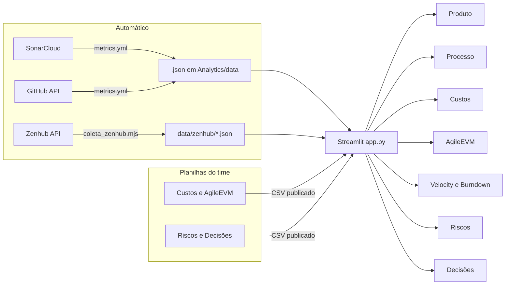

# O que o plano de ensino pede — Dashboards Analíticos e Documentação (EPS 2026.2)

Levantamento feito em 27/09/2026 (véspera da R1). Para cada exigência: o gráfico ou artefato que a atende, de onde vem o dado e **como estamos hoje**.

**Legenda:** ✅ pronto · ⚠️ parcial ou precisa conferir · ❌ falta · 💡 sugestão nossa (não é exigência escrita)

**Fontes**

1. **Plano de ensino** EPS 2026.2 — `fga-eps-mds/A-Disciplina-MDS-EPS/PlanosDeEnsino/EPS_Plano_de_Ensino.md` (tabelas de releases e de dashboards, texto do Dashboard Gerencial e Analítico, composição da nota, Memorando de Decisão).
2. **Critérios detalhados de cada release** enviados pelo professor, transcritos em `docs/disciplina/avaliacao.mdx`. Itens como cobertura ≥ 85%, templates, quadro de conhecimento e nº de decisões vêm daqui, não do texto do plano.

---

## 1. Regras gerais do Dashboard (valem para DA-R1, DA-R2 e DA-R3)

Texto do plano: o Dashboard Gerencial e Analítico é um **artefato dinâmico**, construído **sprint a sprint**, com **múltiplos painéis de apoio à decisão**, integrando **processo, produto e projeto**.

| Exigência do plano | Como atendemos | Status |
|---|---|---|
| Feito em **Streamlit** | `Analytics/app.py` | ✅ |
| Mantido no **repositório de documentação** | `2026.2-MeasureSoftGram-docs-eps/Analytics` | ✅ |
| Consome **direto os .json gerados pelos pipelines de CI/CD a partir do SonarCloud** | `metrics.yml` → `Analytics/data/*.json` → aba Produto | ✅ (AI e Plugin sem projeto no SonarCloud: risco R11) |
| Medidas de **projeto: EVM Ágil e Planilha de Riscos** | Planilhas "Custos e AgileEVM" e "Riscos e Decisões" → abas Custos, AgileEVM, Velocity e Burndown, Riscos | ✅ (falta publicar as planilhas no Google e colar os links no `config.py`) |
| Medidas de **processo: GitHub-Zenhub** | aba Processo (GitHub) + conferência com o Zenhub (snapshot `data/zenhub`) | ✅ |
| **Rastreabilidade e reprodutibilidade** | cada aba tem "📌 De onde vêm os dados e como cada número é calculado"; fórmulas nas planilhas com nota em cada coluna | ✅ |
| Evolui a cada release; avaliado em cada release major | DA-R1 28/09 (30%) · DA-R2 26/10 (30%) · DA-R3 30/11 (40%) | — |
| Pesa **20% da nota final** | Dashboards = DA-R1×0,3 + DA-R2×0,3 + DA-R3×0,4 | — |

### Arquitetura de dados do painel

---

## 2. DA-R1 — 28/09 (30% dos dashboards)

Plano: *"Consolidar os primeiros indicadores técnicos e gerenciais. Ex: velocity, burndown, EVM-Ágil e matriz de riscos."*

| Exigência | Gráfico / indicador | Fonte do dado | Aba do painel | Status |
|---|---|---|---|---|
| **Velocity** | Barras PP × PC por sprint + velocity média (pontos/semana) + taxa de conclusão | Zenhub → aba EVM - Velocity | Velocity e Burndown | ✅ |
| **Burndown** | Linha "restante real" × "restante ideal" + linha do escopo (PRP), por release | EVM - Valor Agregado | Velocity e Burndown | ✅ (por sprint; o Zenhub não guarda histórico diário) |
| **EVM-Ágil** | Cartões PPC, APC, SPI, CPI, término estimado; linhas PV × EV × AC; linhas SPI e CPI com referência 1,0 | Custos e AgileEVM | AgileEVM | ✅ |
| **Matriz de riscos** | Matriz 5×5 P × I com os IDs; exposição por categoria (EAR); evolução por sprint (heatmap) | Riscos e Decisões | Riscos | ✅ |
| Indicadores técnicos | Cobertura, duplicação, sucesso dos testes, nº de testes com meta; cobertura por componente; CI (sucesso, falhas, tempo de feedback) | SonarCloud / GitHub | Produto, Processo | ✅ |
| Streamlit consumindo o .json do pipeline | — | — | — | ✅ |
| Evidência de **uso crítico de IA** no `MD_Template.md` | — | `MD_Template.md` | — | ❌ |
| **URL e PR do app** no Aprender 3 | deploy no Streamlit Cloud (`Analytics/app.py`) | — | — | ❌ |

---

## 3. DA-R2 — 26/10 (30%)

Plano: *"Evolui DA-R1 e incorpora o Dashboard com as métricas de qualidade de produto normalizadas, ponderadas, agregadas e interpretadas pelo time."*

| Exigência | Gráfico / indicador | Fonte | Status |
|---|---|---|---|
| Métricas de qualidade **normalizadas, ponderadas e agregadas** | Árvore do modelo: medidas (0–1) → subcaracterísticas → Manutenibilidade e Confiabilidade → nota total (TSQMI), por repositório e ao longo do tempo | .json SonarCloud (`src/metrics/qualidade.py`) | ⚠️ existe prévia na aba Produto com pesos e limiares herdados de 2026.1 |
| ... **interpretadas pelo time** | Texto de interpretação ao lado de cada gráfico + justificativa dos pesos e limiares | time | ❌ |
| **Comparação R1 × R2** (velocidade, cobertura, defeitos) | Barras lado a lado R1 × R2: velocity média, cobertura por repositório, bugs abertos e fechados | Zenhub, SonarCloud, GitHub | ❌ |
| **≥ 3 decisões gerenciais** com causa + evidência + ação | Cartões na aba Decisões | Riscos e Decisões → Decisões | ⚠️ 3 rascunhos (D1–D3): a equipe precisa validar e registrar o resultado |
| **Uso crítico de IA**: o que foi aceito e o que foi rejeitado | Tabela ou quadro no painel | `MD_Template.md` | ❌ |
| EVM, velocity, burndown e riscos atualizados | mesmas abas do DA-R1 com as sprints 4–7 | planilhas | depende de preencher PP, PC e PA no fim de cada sprint |
| 💡 Distribuição de trabalho por integrante | Barras de issues/PRs/revisões por pessoa | GitHub API | ❌ ajuda no critério individual "contribuições equilibradas" |
| 💡 Tempo de revisão de PR / PRs aprovados | Mediana de horas até a aprovação | GitHub API | ❌ |

---

## 4. DA-R3 — 30/11 (40%)

Plano: *"Evolui DA-R2 e alcança sua forma final com o Canvas Analytics — uma síntese visual do desempenho do produto e do projeto ao longo de todo o semestre, incluindo a análise planejado × realizado e uma retrospectiva crítica sobre o uso de IA generativa no projeto."*

| Exigência | Gráfico / indicador | Fonte | Status |
|---|---|---|---|
| **Canvas Analytics** | Página-resumo com KPIs do semestre (SPI, CPI, velocity, cobertura, nota de qualidade, riscos materializados, decisões) e tendências | todas | ❌ |
| **Planejado × realizado: custo** | PV × EV × AC do semestre; BAC × EAC | AgileEVM | ⚠️ existe por release, falta a visão do semestre |
| **Planejado × realizado: tempo** | Datas planejadas × término estimado (RD) por release | AgileEVM | ⚠️ |
| **Planejado × realizado: escopo** | Histórias aceitas × planejadas; PRP da linha de base × PRP final | Zenhub | ❌ |
| **Planejado × realizado: qualidade** | Meta × real de cobertura (85% → 90%) e nota de qualidade por release | SonarCloud | ⚠️ meta aparece no gráfico de cobertura |
| **≥ 5 decisões gerenciais** (causa, análise, decisão, resultado) | aba Decisões | planilha | ❌ (3 hoje) |
| **Retrospectiva crítica sobre IA** (acertos, erros, onde o julgamento humano foi necessário) | seção de texto + evidências | `MD_Template.md` | ❌ |
| **Prompts usados e outputs aceitos ou descartados** | tabela de evidências | `MD_Template.md` | ❌ |

---

## 5. Documentação (GitHub Pages) por release

### R1 — 28/09 · foco do plano: planejamento, arquitetura, pipelines, dashboard v1, ambientes de implantação, Visão do Produto

| Item | Onde fica | Status |
|---|---|---|
| **Visão do Produto / Canvas MVP** validado com o cliente | `docs/produto/visao-do-produto.mdx` | ❌ página só com o modelo (a DOC#18, Lean Inception, está fechada: passar o conteúdo para esta página) |
| **Backlog priorizado**: histórias com critérios de aceitação | Zenhub + DOC#19 | ⚠️ DOC#19 aberta |
| **Documento de Arquitetura** | `docs/produto/arquitetura.mdx` | ❌ diagrama genérico e ADR vazio (DOC#23) |
| **Protótipos de alta fidelidade** no Figma | link na documentação | ⚠️ conferir |
| **Repositório configurado**: licença, código de conduta, guia de contribuição, templates de PR / Tarefa / Defeito / US | `.github/`, LICENSE | ✅ (DOC#3) |
| **Pipeline CI/CD**: lint, build, testes unitários, relatório SonarCloud | repositórios | ⚠️ taxa de falha da CI em torno de 35% (risco R09) |
| **Coleta inicial de métricas**: `.json` automático via pipeline | `Analytics/data` | ✅ |
| **Cobertura de testes unitários ≥ 85%** | SonarCloud | ❌ Front 80,4%, Service 82,4% e Action 82,7% abaixo (risco R08) |
| **Quadro de conhecimento e pareamentos** | `docs/planejamento/squads.mdx` | ⚠️ conferir: a tabela "Alocação por release" está vazia |
| **Ambiente de homologação** com a release implantada | DOC#51, DOC#71 | ⚠️ em andamento |
| **Planejamento de escopo, tempo, custo e risco** | EAP, cronograma, roadmap, custos, AgileEVM, riscos | ⚠️ EAP, custos, AgileEVM e riscos prontos; roadmap e cronograma com "a definir" |
| **Papéis e lideranças** (rodízio a cada duas semanas) | `docs/equipe/equipe.mdx` | ✅ |
| **`MD_Template.md` com ≥ 2 ciclos** | repositório | ❌ conferir (DOC#54) |
| **Registro das sprints** | `docs/sprints/sprints.mdx` | ⚠️ só a sprint 1, ainda como "Em andamento" |
| **Decisões** | `docs/planejamento/decisoes.mdx` | ⚠️ rascunho D1–D3 |

### R2 — 26/10 · foco do plano: incremento funcional, qualidade, dashboard v2

- Incremento funcional implantado em homologação
- Histórias aceitas pelo cliente, com testes de aceitação documentados
- Backlog atualizado e repriorizado depois do feedback da R1
- Protótipos evoluídos no Figma, com a validação do cliente documentada
- Pipeline com testes de integração e cobertura ≥ 85%
- `.json` de métricas atualizado automaticamente a cada sprint
- Planejamento de capacidade ajustado com os dados reais das sprints (velocity e horas)
- `MD_Template.md` com ≥ 5 ciclos acumulados

### R3 — 30/11 · foco do plano: MVP validado pela(o)s POs, dashboard e analytics completos

- Produto em produção ou homologação e **MVP validado com o cliente**
- Escopo realizado × planejado (histórias aceitas × planejadas)
- Cobertura de testes **≥ 90%**: unitários, integração, sistema e GUI
- Testes de aceitação executados e documentados
- Gerência de configuração: branching, merges, releases com tags
- Manual de instalação do produto para o usuário
- **Relatório de Encerramento** com a seção obrigatória *"Como usamos IA neste semestre"*
- Repositório em conformidade com padrões de software livre
- `MD_Template.md` com ≥ 8 ciclos, com progressão reflexiva

### Releases minor

| Release | Data |
|---|---|
| Rm1 | 13/10 |
| Rm2 | 09/11 |
| Rm3 | 07/12 |

O plano não detalha o conteúdo das minor. 💡 Sugestão: release notes, tag no GitHub e as issues fechadas da versão.

---

## 6. Regras transversais

- **Prazo:** 06h00 (Brasília) do dia da entrega.
- **Apresentações:** R1 e R2 com 20 min, R3 com 30 min; todos os membros participam; gravação no Teams; release implantada em homologação no dia.
- **Memorando de Decisão (individual):** MD-R1 29/09 (20%), MD-R2 27/10 (20%), MD-R3 08/12 (30%). Fundamentar com teoria decisões técnico-gerenciais reais que a pessoa tomou ou co-liderou.
- **Individual:** contribuições rastreáveis (commits, PRs, issues com autoria) e capacidade de explicar qualquer trecho de código em revisão síncrona.
- **Nota final:** Releases × 0,60 + Dashboards × 0,20 + Individual × 0,20.

---

## 7. Prioridades até 28/09, 06h00

1. **Publicar o dashboard** no Streamlit Cloud e enviar a URL e o PR no Aprender 3.
2. **Importar e publicar as duas planilhas** e colar os links no `config.py`.
3. **Visão do Produto e Arquitetura** no GitHub Pages: são itens de foco da R1 e as páginas estão vazias.
4. **Registro de uso de IA** no `MD_Template.md` com ≥ 2 ciclos (vale para o DA-R1 e para a parte individual).
5. **Validar com o time** as decisões D1–D3, os riscos e as estimativas.
6. **Registrar as sprints 2 e 3** e corrigir o status da sprint 1.
7. **Cobertura ≥ 85%** no Front, Service e Action: se não der tempo, declarar a pendência no painel e no plano de riscos (R08).
