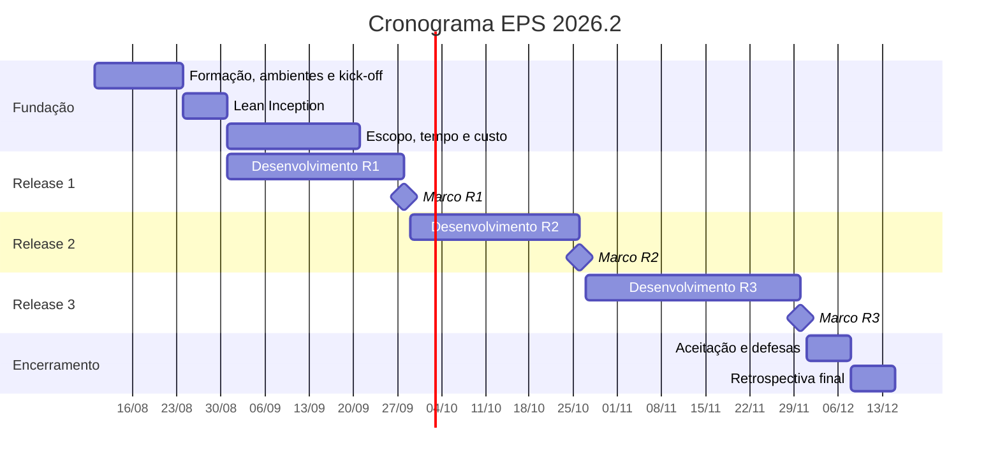

# Cronograma 2026.2

Aulas às segundas, 10h00–13h30, sala MOCAP. **Primeira aula:** 10/08/2026 ·
**Última aula:** 14/12/2026.

| Símbolo | Significado |
| --- | --- |
| 📦 | Release major |
| 📋 | Marco de Memorando de Decisão |
| 📊 | Marco de Dashboard |
| 🚫 | Sem aula |

## Visão geral

| Semana | Data | Tema | Marcos |
| --- | --- | --- | --- |
| 1 | 10/08 | Plano de ensino, times e ambientes | |
| 2 | 17/08 | Visões filosóficas do gerenciamento · Kick-off | |
| 3 | 24/08 | Lean Inception · Ciclo de vida | 📋 MD-R1 |
| 4 | 31/08 | ATP1 — Escopo + Tempo | 📋 MD-R1 |
| 5 | 14/09 | ATP2 — Custo e EVM-Ágil | 📋 MD-R1 |
| — | 21/09 | 🚫 Semana Universitária | |
| 6 | **28/09** | 📦 **RELEASE R1** | 📊 DA-R1 · 📋 MD-R1 (29/09) |
| 7 | 05/10 | ATP3 — Risco + Kanban | 📋 MD-R2 |
| — | 12/10 | 🚫 Feriado (N. Sra. Aparecida) | |
| 8 | 19/10 | ATP4 — Qualidade de Software | 📋 MD-R2 |
| 9 | **26/10** | 📦 **RELEASE R2** | 📊 DA-R2 · 📋 MD-R2 (27/10) |
| — | 02/11 | 🚫 Feriado (Finados) | |
| 10 | 09/11 | ATP5 — SQALE, Quamoco, Q-Rapids, Analytics | 📋 MD-R3 |
| 11 | 16/11 | ATP6 — Implantação e Entrega Contínua | 📋 MD-R3 |
| 12 | 23/11 | ATP7 — Visão Estratégica | 📋 MD-R3 |
| 13 | **30/11** | 📦 **RELEASE R3 (final)** | 📊 DA-R3 |
| 14 | 07/12 | Release Final — aceitação e defesas orais | 📋 MD-R3 (08/12) |
| 15 | 14/12 | Encerramento e retrospectiva geral | |

## Semana a semana

### Semana 1 — 10/08 · AT1

- Plano de ensino e cronograma 2026.2
- Temas dos projetos e organizações parceiras
- Formação dos times (10–20 membros)
- Configuração dos ambientes: GitHub, ZenHub, SonarCloud, Figma, Discord

### Semana 2 — 17/08 · AT2

- Visões filosóficas e seu reflexo na prática do gerenciamento
- **Kick-off dos projetos:** reunião com usuários e donos dos produtos

✅ **IA:** rascunho-hipótese da visão de produto **antes** do kick-off, para
descobrir onde a IA erra ao confrontar o contexto real; Copilot para sugerir
perguntas de elicitação.
⚠️ **Limite:** a reunião de kick-off é 100% humana.

### Semana 3 — 24/08 · AT3

**Leitura obrigatória:** Lean Inception, Paulo Caroli (cap. 1–7) · *bilhete de
entrada exigido*

- Lean Inception: estrutura, dinâmicas, personas, jornadas, brainstorming de
  funcionalidades, sequenciador
- Ciclo de vida do projeto e do produto
- Diferenças e semelhanças entre manufatura e software

✅ **IA:** expandir personas e sugerir funcionalidades; comparar funcionalidades
do sequenciador com os épicos no ZenHub.
⚠️ **Limites:** a priorização do canvas é decisão do time com o cliente; a
validação da visão do produto com usuários reais é obrigatória.

### Semana 4 — 31/08 · ATP1 — Escopo + Tempo

**Leitura obrigatória:** Gerenciamento de Projetos (Iniciação, Planejamento,
Escopo, Tempo) + Guia do Scrum (backlog do produto e do sprint) + Succeeding with
Agile, Mike Cohn (cap. 1–3) · *bilhete de entrada exigido*

- **Escopo:** EAP, backlog de produto, épicos e histórias de usuário; ZenHub
  roadmap e milestones
- **Tempo:** estimativas (Planning Poker, pontos por história), velocidade,
  burndown, Gantt no ZenHub

✅ **IA:** expandir épicos em histórias e sugerir critérios de aceitação; gerar
estimativas iniciais como linha de base de calibração; automatizar relatórios de
velocidade.
⚠️ **Limites:** a priorização do backlog exige negociação com o cliente; o
Planning Poker é exercício coletivo de calibração e a IA não o substitui.

:::note Ligação com o nosso projeto
É esta semana que ancora a construção da **EAP** e do **planejamento de releases**
do MeasureSoftGram — a base para a formação dos
[squads por release](/docs/planejamento/squads).
:::

### Semana 5 — 14/09 · ATP2 — Custo

**Leitura obrigatória:** Gerenciamento de Projetos (Custos) + artigo EVM-Ágil

- Custo tradicional e ágil
- EVM-Ágil: planilha e gráficos

✅ **IA:** estruturar a planilha EVM e calcular CPI, SPI e EAC; interpretar
índices e sugerir causas de desvio.
⚠️ **Limites:** análise de causa e replanejamento são do time; EVM exige dados
reais de horas — a planilha individual é mandatória.

### 🚫 21/09 — Semana Universitária

Sem aula (20/09 a 25/09). **Projetos e sprints não param.**

### 📦 Semana 6 — 28/09 · RELEASE MAJOR R1

Data-limite de registro nos repositórios; release implantada em homologação.
Apresentação de 20 min por time, reunião de 2h, gravada no Teams.

Critérios completos em [Avaliação](/docs/disciplina/avaliacao#critérios-da-r1--2809).

📊 **DA-R1:** submeter URL e PR do app Streamlit no Aprender 3.
📋 **MD-R1:** submeter `MD_XX_Matrícula` antes das 06h00 de **29/09**.

✅ **IA:** rascunho de slides com dados do ZenHub, SonarCloud, GitHub e EVM;
verificação de consistência documentação × implementação.
⚠️ **Limite:** a apresentação e a defesa das decisões são humanas.

### Semana 7 — 05/10 · ATP3 — Risco + Kanban

**Leitura obrigatória:** Gerenciamento de Projetos (Riscos) + *Management of novel
projects under conditions of high uncertainty* (De Meyer, Loch & Pich) +
Engenharia de Software Moderna (cap. 2, Kanban) · *bilhete de entrada exigido*

- **Risco:** análise qualitativa e quantitativa, plano de resposta; Scrum:
  artefatos, práticas e papéis
- **Kanban:** fluxo contínuo, WIP limits, lead time, throughput; feedback pós-R1

✅ **IA:** sugerir riscos não mapeados; gerar plano de resposta inicial por
categoria; analisar lead time e sugerir ajustes de WIP.
⚠️ **Limites:** riscos de relacionamento com o cliente são identificados apenas
pelo time; probabilidade e impacto são calibrados por julgamento humano; ajustes
de processo se decidem na retrospectiva.

### 🚫 12/10 — Feriado (Nossa Senhora Aparecida)

### Semana 8 — 19/10 · ATP4 — Qualidade de Software

**Leitura obrigatória:** ISO 25010 + *The SQALE Analysis Model* (Letouzey & Coq)

- Qualidade ao longo do tempo: McCall, Boehm, Dromey, ISO 9126/25010
- Análise ao vivo: dashboard SonarCloud do próprio projeto × ISO 25010

✅ **IA:** interpretar métricas do SonarCloud à luz da ISO 25010 — o output é
criticado coletivamente em aula.
⚠️ **Limite:** a escolha do modelo de qualidade e dos limiares aceitáveis é
decisão do time com o professor.

### 📦 Semana 9 — 26/10 · RELEASE MAJOR R2

Incremento funcional implantado em homologação. Apresentação de 20 min, reunião
de 2h, gravada no Teams.

Critérios completos em [Avaliação](/docs/disciplina/avaliacao#critérios-da-r2--2610).

📊 **DA-R2:** submeter URL e PR do app Streamlit no Aprender 3.
📋 **MD-R2:** submeter antes das 06h00 de **27/10**.

⚠️ **Limites:** `MD_Template.md` com ≥ 5 ciclos acumulados; ≥ 3 decisões
gerenciais documentadas com causa + evidência + ação.

### 🚫 02/11 — Feriado (Finados)

### Semana 10 — 09/11 · ATP5 — SQALE, Quamoco, Q-Rapids e Software Analytics

**Leitura obrigatória:** *A Quality Model for Actionable Analytics in Rapid
Software Development* (Martínez-Fernández et al.) + *Towards an artifact to
support agile teams in software analytics activities* (Choma et al.) + *Technical
Debt Management in Brazilian Software Organizations* (Silva, Jerônimo &
Travassos) · *bilhete de entrada exigido*

- Squale, Quamoco, Q-Rapids e outros modelos de avaliação de qualidade
- Software Analytics: padrões para decisão orientada a dados

✅ **IA:** sugerir normalizações e transformações das métricas; código
Python/Pandas para tratar o `.json` do SonarCloud; sugerir limiares com base em
benchmarks da literatura.
⚠️ **Limites:** a interpretação dos gráficos e as decisões são do time; o limiar
de qualidade deve ser validado com o professor antes de adotado.

### Semana 11 — 16/11 · ATP6 — Implantação e Entrega Contínua

**Leitura obrigatória:** Engenharia de Software Moderna (cap. 10) + *Continuous
software engineering: A roadmap and agenda* (Fitzgerald & Stol)

- CI/CD avançado
- Engenharia de Software Contínua: conceito, práticas e cultura

✅ **IA:** evoluir pipelines (SAST, deploy automático); revisar o pipeline e
identificar lacunas.
⚠️ **Limite:** a estratégia de deploy em produção para o parceiro real requer
aprovação humana.

### Semana 12 — 23/11 · ATP7 — Visão Estratégica

- Visão estratégica: portfólios, programas e ecossistema de produtos públicos
- Roteiro de encerramento do projeto

✅ **IA:** estrutura visual do Canvas Analytics; rascunho do Relatório de
Encerramento.
⚠️ **Limites:** a seção "Decisões gerenciais" do relatório é escrita pelos
estudantes; a análise planejado × realizado exige julgamento humano sobre causas
reais.

### 📦 Semana 13 — 30/11 · RELEASE MAJOR R3 (final)

Produto em produção/homologação, MVP validado com o cliente. Foco: **planejado ×
realizado** em todas as dimensões.

Critérios completos em [Avaliação](/docs/disciplina/avaliacao#critérios-da-r3--3011).

📊 **DA-R3:** submeter URL e PR do app Streamlit final no Aprender 3.

✅ **IA:** refactoring e cobertura final (meta ≥ 90%); revisão final do README e
da documentação de instalação.
⚠️ **Limites:** a defesa de decisões gerenciais é individual; `MD_Template.md`
com ≥ 8 ciclos e progressão reflexiva visível.

### Semana 14 — 07/12 · Release Final (RF)

- Encerramento do projeto e reforço de segurança do produto
- Testes de aceitação com o cliente: execução e documentação
- Finalização do Relatório de Encerramento
- Início das defesas orais individuais

📋 **MD-R3:** submeter arquivo + evidências antes das 06h00 de **08/12**.

✅ Seção obrigatória na apresentação: **"Como usamos IA neste semestre"** (5 min).
⚠️ **Limites:** os testes de aceitação com o cliente são humanos e documentados
formalmente; o Relatório de Encerramento exige seção reflexiva escrita pelo time.

### Semana 15 — 14/12 · Encerramento

Último dia oficial de aulas. Retrospectiva geral da disciplina. Serve também como
**buffer de contingência**.

## Histórico de versão

| Versão | Data | Descrição | Autor | Revisor |
| --- | --- | --- | --- | --- |
| 1.0 | 10/09/2026 | Criação a partir do cronograma oficial 2026.2 | [@MilenaFRocha](https://github.com/MilenaFRocha) | |
