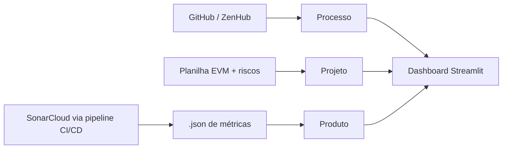

# Métricas

Indicadores que a equipe acompanha ao longo do semestre, separados entre métricas
de **processo** (como a equipe trabalha), de **projeto** (custo, prazo e risco) e
de **produto** (qualidade do que é entregue).

As três dimensões alimentam o **Dashboard Gerencial e Analítico**, que vale 20%
da nota final e é avaliado em cada release — ver
[Avaliação](/docs/disciplina/avaliacao#dashboard-gerencial-e-analítico).

## Origem dos dados

:::info Requisito da disciplina
O dashboard deve ser feito em **Streamlit**, ficar no repositório de documentação
e **consumir diretamente os arquivos `.json`** gerados automaticamente pelo
pipeline a partir do SonarCloud — não vale colar números à mão.
:::

## Métricas de processo

Fonte: GitHub e ZenHub.

| Métrica | Definição | Meta | Frequência |
| --- | --- | --- | --- |
| Velocidade | Pontos concluídos por sprint | Estabilizar após 2 sprints | Por sprint |
| Taxa de conclusão | Tarefas concluídas / planejadas | ≥ 80% | Por sprint |
| Lead time | Tempo entre início e conclusão de uma tarefa | *a definir* | Contínua |
| Throughput | Issues fechadas por semana | *a definir* | Semanal |
| Burndown | Trabalho restante ao longo da sprint | Tendência descendente | Por sprint |
| Distribuição de contribuições | Commits/PRs por integrante | Sem concentração excessiva | Por release |

:::tip Por que a distribuição importa
A R2 exige **contribuições rastreáveis equilibradas entre os membros**. Essa
métrica é também a evidência de que o modelo de
[squads por release](/docs/planejamento/squads) está de fato resolvendo o
desbalanceamento de carga.
:::

## Métricas de projeto

Fonte: planilha de EVM-Ágil (horas reais individuais) e planilha de riscos.

| Métrica | Definição | Meta |
| --- | --- | --- |
| CPI | Índice de desempenho de custo (EV / AC) | ≈ 1,0 |
| SPI | Índice de desempenho de prazo (EV / PV) | ≈ 1,0 |
| EAC | Estimativa no término | Dentro do orçamento planejado |
| Riscos abertos por severidade | Contagem da matriz de riscos | Sem risco alto sem resposta |

Ver [Riscos](/docs/planejamento/riscos). O conteúdo teórico de EVM entra na
[semana 5, 14/09](/docs/disciplina/cronograma).

## Métricas de produto

Como o próprio MeasureSoftGram é uma ferramenta de medição de qualidade, a equipe
usa o produto para avaliar os próprios repositórios — e o SonarCloud como
referência cruzada.

| Métrica | Definição | Meta R1/R2 | Meta R3 |
| --- | --- | --- | --- |
| Cobertura de testes | Percentual de linhas cobertas | **≥ 85%** (unitários) | **≥ 90%** (unitários, integração, sistema e GUI) |
| Densidade de duplicação | Percentual de linhas duplicadas | *a definir* | *a definir* |
| Densidade de problemas | Issues por mil linhas | *a definir* | *a definir* |
| Dívida técnica (SQALE) | Tempo estimado de remediação | Não crescer entre releases | Reduzir em relação à R2 |
| Vulnerabilidades e security hotspots | Contagem do SonarCloud | 0 críticas | 0 críticas |

:::caution Limiares precisam ser validados
A escolha do modelo de qualidade e dos limiares aceitáveis é decisão do time
**com o professor** (semana 8, 19/10). As metas marcadas como *a definir* devem
ser preenchidas até a R2, com justificativa baseada em benchmark da literatura ou
na linha de base medida na R1.
:::

## Acompanhamento

| Sprint / Release | Velocidade | Taxa de conclusão | Cobertura | CPI | SPI | Observações |
| --- | --- | --- | --- | --- | --- | --- |
| Sprint 1 | | | | | | Diagnóstico do ecossistema |
| | | | | | | |

## Decisões baseadas em dados

Registro das decisões gerenciais tomadas a partir das métricas. A disciplina
exige **≥ 3 decisões documentadas na R2** e **≥ 5 na R3**, cada uma com causa,
análise, decisão e resultado.

| # | Data | Métrica que disparou | Causa identificada | Decisão | Resultado observado |
| --- | --- | --- | --- | --- | --- |
| 1 | | | | | |

## Histórico de versão

| Versão | Data | Descrição | Autor | Revisor |
| --- | --- | --- | --- | --- |
| 1.0 | 10/09/2026 | Inclusão das dimensões de projeto e das metas do plano de ensino | [@MilenaFRocha](https://github.com/MilenaFRocha) | |
