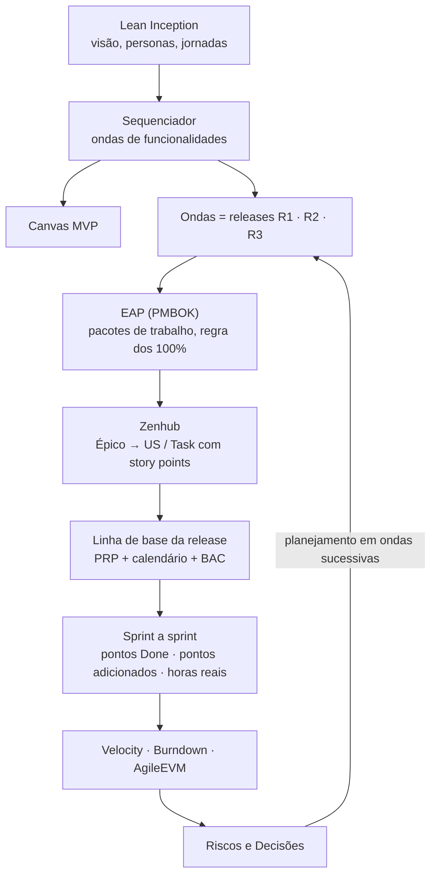

# Modelo de gestão do projeto

Esta página define **o que cada número do Dashboard Analítico representa, de onde
ele vem e quem o mantém**. Ela existe porque um indicador só serve para decidir
se a equipe concorda sobre o que ele mede. Sem esse acordo, a velocity e o EVM
viram gráficos, e não instrumentos de gestão.

## 1. A cadeia de rastreabilidade

- **Lean Inception** diz *o que* entra no produto e em que ordem. O sequenciador
  fatia as funcionalidades em ondas, e cada onda vira uma release.
- **PMBOK** transforma as ondas em escopo gerenciável. A EAP garante que nada
  fique de fora (regra dos 100%). O que ainda não pode ser decomposto fica como
  pacote de planejamento (ondas sucessivas).
- **Scrum** transforma escopo em compromisso por sprint: US e Tasks estimadas
  em story points e aceitas pelo PO.
- **AgileEVM** mede o desempenho contra a linha de base: estamos entregando o
  escopo no ritmo planejado (SPI) e ao custo planejado (CPI)?

## 2. Decisões que fixam as regras

| Decisão | Valor adotado | Por quê |
| --- | --- | --- |
| Calendário oficial | O do **Zenhub**: S1 24/08–06/09, S2 07/09–20/09, semanais a partir de 21/09 | É o único que fecha exatamente nas datas das releases (27/09, 25/10, 29/11). A planilha quinzenal anterior terminava a R1 em 04/10. |
| Sprints por release (L) | R1 = 3 · R2 = 4 · R3 = 5 | Consequência do calendário. |
| Critério de "feito" | Issue no pipeline **Done** | Só chega ao Done o que passou pela aprovação do PO (DoD). Issue fechada em outro pipeline não conta como entregue. |
| O que recebe story points | **US (Feature) e Task.** Bug entra como Task de correção. | Épicos e Initiatives agregam, e Sub-tasks decompõem. Estimar em mais de um nível conta o mesmo trabalho duas vezes. |
| Custo | Horas reais × custo/hora de dev júnior | O custo/hora só converte horas em R$. CPI e SPI não dependem dele. |
| Horas reais | Aba **Horas**, lançada por cada integrante na planning de segunda | Sem horas reais não existe AC. Não se preenche o passado por estimativa. |

## 3. O que cada informação representa

### Parâmetros (`planilhas/parametros.csv`)

A linha de base de custo, segundo a área de custos do PMBOK (estimar custos →
determinar orçamento).

| Campo | Significado |
| --- | --- |
| `pessoas` | Integrantes que dedicam horas ao projeto. |
| `horas_semana_pessoa` | Capacidade planejada por integrante. Multiplicada por pessoas e semanas, dá as **horas planejadas da release**. |
| `custo_hora` | Salário mensal de referência de dev júnior ÷ 160 h. A fonte e a data precisam ser citadas. |
| `criterio_feito`, `niveis_pontuados` | As regras da seção 2, lidas pelo dashboard. |

### Calendário (`sprints.csv`, `releases.csv`)

| Campo | Significado |
| --- | --- |
| `sprint`, `release`, `inicio`, `fim` | Calendário oficial. `n` é a posição da sprint dentro da release, e `L` é o total de sprints dela. |
| `prp_linha_de_base` | **Planned Release Points**: soma dos pontos das US/Tasks comprometidas para a release, **congelada na planning de abertura**. Tudo o que entra depois é PA. |

### Zenhub (`data/zenhub/*.json`)

Snapshot do quadro, gerado por `scripts/coleta_zenhub.py`. Dele saem:

| Sigla | Nome | Definição |
| --- | --- | --- |
| PP | Pontos planejados | Pontos das US/Tasks na sprint. |
| PC | Points Completed | Pontos das issues no pipeline Done. |
| PA | Points Added | Pontos que entraram na release além da linha de base. |
| RPC | Release Points Completed | PC acumulado na release, sem contar a mesma issue duas vezes. |

### AgileEVM

Sulaiman, Barton e Blackburn (2006), calculado por release:

| Sigla | Fórmula | Leitura |
| --- | --- | --- |
| PPC | n / L | Quanto da release *deveria* estar pronto. |
| APC | RPC / PRP | Quanto da release *está* pronto. |
| BAC | horas planejadas da release × custo/hora | Orçamento da release. |
| PV | PPC × BAC | Valor planejado até aqui. |
| EV | APC × BAC | Valor agregado até aqui. |
| AC | Σ horas reais × custo/hora | Custo real até aqui. |
| SPI | EV / PV = APC / PPC | Abaixo de 1 significa atraso. |
| CPI | EV / AC | Abaixo de 1 significa gastar mais do que se entrega. |
| SV, CV | EV − PV, EV − AC | Variâncias em valor. |
| ETC, EAC | (BAC − EV) / CPI, AC + ETC | Projeção de custo final. |
| RD | L / SPI | Em quantas sprints a release fecha, no ritmo atual. |

### Riscos (`riscos.csv`)

Registro de riscos do PMBOK. Os campos são: **categoria**, **risco**, **gatilho**
(o sinal observável de que ele está ocorrendo), **probabilidade** e **impacto**
(escala de 1 a 5, com exposição = P × I de 1 a 25; ver [Plano de Riscos](/docs/planejamento/riscos)), **resposta** (Evitar, Mitigar,
Transferir ou Aceitar), **plano de resposta**, **responsável**, **status** e
**última revisão**. Um risco sem responsável não tem resposta. O registro é
revisado em toda retrospectiva.

### Decisões (`decisoes.csv`)

Fecha o ciclo: *métrica → causa → decisão → resultado*. É a evidência de gestão
baseada em dados, e a R2 cobra ≥ 3 registros, a R3 ≥ 5.

## 4. O que a R1 mostra

A R1 **não tem linha de base declarada**. As sprints 1 e 2 foram de diagnóstico,
migração de repositórios e Lean Inception, sem pontos. O sequenciador não fechou,
um risco já materializado (R10). Por isso o dashboard **reconstitui** o PRP da R1
a partir do que entrou no Zenhub e declara isso na tela.

A contribuição da DA-R1 é estabelecer o modelo, expor a qualidade do dado do
quadro e congelar a linha de base da R2 na planning de 28/09.

## 5. Rotina de atualização

| Quando | O quê | Quem |
| --- | --- | --- |
| Planning de abertura da release | Congelar `prp_linha_de_base` | Líderes da quinzena |
| Toda segunda (planning) | Lançar as horas da semana na aba Horas | Cada integrante |
| Fim de cada sprint | Rodar `coleta_zenhub.py` e mover issues entregues para Done | Líderes da quinzena |
| Toda retrospectiva | Revisar riscos e registrar decisões | Equipe |

## Referências

- SULAIMAN, T.; BARTON, B.; BLACKBURN, T. **AgileEVM: Earned Value Management in Scrum Projects**. Agile Conference, 2006.
- PMI. *PMBOK Guide*: gerenciamento de escopo, cronograma, custos e riscos.
- CAROLI, P. **Lean Inception**.
- SCHWABER, K.; SUTHERLAND, J. **Guia do Scrum**.

## Histórico de versão

| Versão | Data | Descrição | Autor | Revisor |
| --- | --- | --- | --- | --- |
| 1.0 | 27/09/2026 | Modelo de gestão e dicionário de dados do DA-R1 | [@MilenaFRocha](https://github.com/MilenaFRocha) | |
