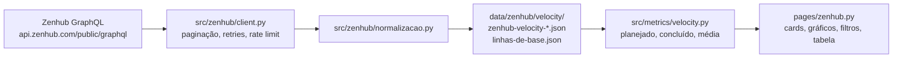

# Velocity pela API do Zenhub

A aba **Projeto → Velocity (Zenhub)** do [dashboard](https://20262-measuresoftgram-doc.streamlit.app/) mostra,
por sprint, os story points **planejados** e **concluídos**, a quantidade de
issues, a release e a **Average Velocity** das sprints concluídas. Tudo vem da
API GraphQL pública do Zenhub; nenhum número é digitado ou simulado.

## Como os dados chegam



| Onde roda | Quem chama a API | Chave |
| --- | --- | --- |
| GitHub Actions (`coleta-dados.yml`, a cada push na main e 3×/dia) | `scripts/coleta_velocity.py` | secret `ZENHUB_API_KEY` |
| Máquina do time (`streamlit run app.py`) | botão **Atualizar dados** ou o script | `Analytics/.env` |
| Streamlit Community Cloud (app publicado) | ninguém: só lê o último snapshot | nenhuma |

O dashboard publicado não tem backend, então **a chave nunca vai para o
navegador**: ele lê o snapshot que o workflow gravou. O botão **Atualizar dados**
fica desabilitado lá e funciona na execução local.

## Campos da API utilizados

Conferidos no schema público do Zenhub
(`developers.zenhub.com/schema/zenhub-public-api.graphql`, lido em 27/09/2026) e
validados com `graphql.validate` antes de escrever o código. As queries estão em
`Analytics/src/zenhub/queries.py`.

| Tipo.campo | Para que serve |
| --- | --- |
| `Workspace.sprints(orderBy: START_AT)` | lista de sprints |
| `Sprint.id`, `name`, `generatedName`, `startAt`, `endAt`, `state` (`OPEN`/`CLOSED`) | identificação, período e situação |
| `Sprint.issues` | escopo **atual** da sprint |
| `Sprint.scopeChange` → `ScopeChange.action` (`ISSUE_ADDED`/`ISSUE_REMOVED`), `effectiveAt`, `estimateValue`, `issue` | histórico de escopo: base do **planejado** |
| `Sprint.totalPoints`, `completedPoints`, `closedIssuesCount` | números do próprio Zenhub, só para conferência |
| `Issue.id`, `number`, `title`, `repository.name`, `htmlUrl` | identificação |
| `Issue.estimate.value` | story points |
| `Issue.state` (`OPEN`/`CLOSED`), `Issue.closedAt` | conclusão e data de conclusão |
| `Issue.pipelineIssue(workspaceId).pipeline.name`, `.latestTransferTime` | pipeline atual da issue (situação no quadro; não define se está feita) |
| `Issue.issueType` (união `GithubIssueType`/`ZenhubIssueType`, campo `name`) | só Feature, Task e Bug pontuam |
| `Issue.parentIssue.id`, `Issue.pullRequest` | não somar pai e filha; ignorar PR |
| `Workspace.releases` → `Release.id`, `title`, `startOn`, `endOn`, `state`, `closedAt`, `issues` | release de cada sprint |

Limites da API que o cliente trata: paginação Relay (`first`/`after`, máximo 100),
**complexidade máxima de 200 pontos por query** (o cliente usa páginas pequenas e
reduz pela metade se o Zenhub recusar), 90 s de processamento por minuto por
chave (HTTP 429 → espera `Retry-After` ou backoff exponencial), timeout e 5xx
(até 5 tentativas), 401/403 (erro de autenticação, sem nova tentativa) e nós
repetidos entre páginas (descartados pelo `id`).

:::note Achado ao conferir o schema
`issueType { name }` — usado no antigo `scripts/coleta_zenhub.py` (removido,
substituído por `coleta_velocity.py`) — **não é válido** no schema atual:
`issueType` é uma união e exige fragmentos (`... on GithubIssueType { name }`).
:::

## Regras de cálculo

**Issue pontuável.** US (`Feature`), `Task` e `Bug` sem filhas, conforme
`config.PARAMETROS` (Analytics/config.py) (`niveis_pontuados`, decisão D2). PR, Épico e Sub-task
não pontuam. Issue pontuável **sem estimativa** conta como issue, com **0 SP**,
e é sinalizada na coluna de observações — o painel nunca estima por ela.

**Planned SP.** Issues pontuáveis que estavam na sprint ao fim da **janela de
planning** (início + 24 h, parâmetro `janela_planning_horas`, porque a planning
acontece no primeiro dia). O conjunto é reconstituído pelo `scopeChange`, e a
estimativa de cada issue é a do evento de entrada (`estimateValue`). Uma issue
que entra depois não altera o planejado; se for concluída, aparece em
"Adicionado depois".

O `scopeChange` só registra o que muda **depois** que a sprint começa. Por isso,
as issues que já estavam na sprint no início (sem nenhum evento no histórico, ou
cujo primeiro evento é uma saída) também entram no planejado, com a estimativa
**atual** — o Zenhub não guarda a estimativa da época para elas. A coluna
"Linha de base" diz quantas issues entraram por essa regra.

**Completed SP = Velocity.** Issues pontuáveis concluídas **entre o início e o
fim** da sprint e que estavam na sprint naquele momento. **Critério de
feito: a issue só precisa estar fechada** (conclusão = `closedAt`); issue aberta não
conta, em nenhum pipeline (nem no `Done`). Issue fechada depois do fim
não conta naquela sprint; issue movida para outra sprint conta onde estava ao
fechar.

**Average Velocity.** Média da velocity das sprints **concluídas** que estão no
filtro. A sprint em andamento (mostrada à parte, com valores parciais) e as
canceladas ficam fora. Só aparece com pelo menos 2 sprints concluídas
(`min_sprints_media_velocity`).

**Completion rate** = Completed ÷ Planned × 100. Planejado zero ou indisponível
→ vazio, sem divisão.

**Release.** A release do Zenhub que contém mais issues da sprint; sem isso, a
release cujas datas cobrem o fim da sprint; sem isso, a data de entrega do plano
de ensino (R1 28/09, R2 26/10, R3 30/11). A coluna "Fonte da release" diz qual regra valeu.

## Limitações (e o que foi feito para não inventar número)

1. **O Zenhub não guarda um snapshot do início da sprint.** O que existe é o
   histórico de entradas e saídas (`scopeChange`). Ele permite saber *quais*
   issues estavam na sprint no início, e com que estimativa **entraram** — mas
   não registra mudanças de estimativa feitas *depois* da entrada. Se uma issue
   entrou com 3 SP antes da sprint e foi re-estimada para 5 SP antes da
   planning, o planejado usa 3.
2. **Por isso o planejado é congelado.** Na primeira coleta após a janela de
   planning, o planejado de cada sprint é gravado em
   `data/zenhub/velocity/linhas-de-base.json` e não muda mais. Com a coleta
   diária do workflow, a linha de base das próximas sprints fica exata.
3. **Sem histórico, não há planejado.** Se o Zenhub não devolver `scopeChange`
   para uma sprint que tem issues, o planejado aparece como *indisponível*. O
   escopo atual é mostrado separado ("Escopo atual SP") e nunca substitui o
   planejado.
4. **Estimativa do concluído é a atual.** A API não expõe o histórico de
   estimativas; os pontos concluídos usam `estimate.value` no momento da coleta.
5. **Issue aberta no `Done` não conta.** O critério de feito é a issue estar
   fechada; aberta no `Done` aparece como "Em andamento" até ser fechada.
6. **Sprint cancelada** não existe no Zenhub. Para tirar uma sprint da média,
   liste o id dela em `sprints_canceladas` (separado por `;`) em
   `config.PARAMETROS` (Analytics/config.py).
7. O `completedPoints` do Zenhub aparece na tabela só como conferência: ele usa o
   estado atual das issues, não a data em que foram concluídas.

## Erro de TLS no Windows (`SSLEOFError`)

Em algumas máquinas o antivírus ou o firewall corta a conexão TLS do Python com
`api.zenhub.com` (`SSL: UNEXPECTED_EOF_WHILE_READING`), enquanto o Node conecta
normalmente (o time já tinha um coletor antigo em Node por isso). O cliente
detecta esse erro e passa a fazer as requisições pelo Node
(`scripts/zenhub_post.mjs`, Node 18+), sem mudar nada no resto da coleta. Para
forçar: `ZENHUB_TRANSPORTE=node`. Para investigar:
`python scripts/diagnostico_zenhub.py` (não imprime a chave).

## Como rodar

```bash
cd Analytics
cp .env.example .env          # preencher ZENHUB_API_KEY (nunca commitar)
python scripts/coleta_velocity.py
streamlit run app.py          # aba Projeto → Velocity (Zenhub)
python -m unittest discover -s tests -v
```

No GitHub: criar o secret `ZENHUB_API_KEY` em *Settings → Secrets and variables →
Actions*. O workflow `coleta-dados.yml` roda a cada push na `main` e 3 vezes por dia, commita
o snapshot e o Streamlit Cloud republica o dashboard sozinho.
