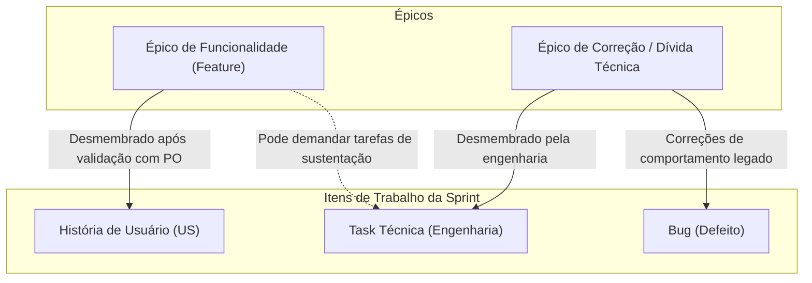

# Gestão do Backlog

Este documento estabelece as diretrizes de governança, taxonomia dos itens de trabalho, acordos de qualidade e critérios de transição adotados pela equipe do **MeasureSoftGram** para o gerenciamento do seu backlog no ZenHub e GitHub.

A separação dos conceitos descrita aqui reflete as decisões metodológicas e acordos firmados com o Product Owner (PO) em reunião de alinhamento, assegurando que regras de negócio e tarefas de engenharia de software possuam fluxos e critérios adequados de refinamento e conclusão.

---

## 1. Taxonomia dos Itens de Trabalho

Para garantir previsibilidade no desenvolvimento e manter a rastreabilidade entre esforço técnico e valor entregue ao negócio, os itens de trabalho são categorizados em quatro níveis fundamentais:

### 1.1 Épico de Funcionalidade (Feature Epic)
* **Objetivo:** Representa uma entrega macro de nova capacidade, módulo ou valor percebido diretamente pelo usuário final e pelas partes interessadas.
* **Exemplos no projeto:** *Operacionalizar a Medição de Dívida Técnica*
* **Desdobramento:** Desmembra-se prioritariamente em **Histórias de Usuário (US)** e eventuais tarefas habilitadoras de infraestrutura.

:::caution[Validação Prévia Obrigatória com o PO]
Nenhum Épico de Funcionalidade pode ser desmembrado em Histórias de Usuário antes que o time de EPS realize uma sessão de alinhamento e refinamento com o Product Owner para **sanar dúvidas de negócio, validar escopo funcional e alinhar o entendimento do valor esperado**.
:::

### 1.2 Épico de Correção (Maintenance Epic)
* **Objetivo:** Focado na estabilização, saneamento arquitetural, eliminação de gargalos legados, performance e reestruturação de infraestrutura/pipeline do ecossistema.
* **Exemplos no projeto:** *Otimização de requisições SWR e eliminação de chamadas em cascata no Next.js*, *Padronização de CI/CD central com Git Flow e eliminação de sobrecarga em forks*.
* **Desdobramento:** Desmembra-se em **Tasks Técnicas** e **Bugs**.
* **Validação:** Controlado e homologado internamente pela equipe de engenharia por meio de métricas técnicas (tempo de carregamento, cobertura de testes, Quality Gate e ausência de regressões).

### 1.3 História de Usuário (US)
* **Objetivo:** Unidade mínima de entrega de valor de negócio ao usuário. Descreve uma necessidade funcional sob a perspectiva de uma persona específica no formato:
  > **Como** [persona/papel],  
  > **Quero** [ação/funcionalidade],  
  > **Para que** [benefício/valor de negócio].
* **Governança:** Contém exclusivamente **Critérios de Aceitação redigidos em formato BDD** e depende de aprovação funcional formal do Product Owner.

### 1.4 Task Técnica (Tarefa de Engenharia / Enabler)
* **Objetivo:** Atividade estritamente técnica, arquitetural, de configuração ou de infraestrutura necessária para suportar o desenvolvimento ou a manutenção contínua do sistema.
* **Exemplos:** Criação de endpoints no `MeasureSoftGram-Service`, configuração de pipelines de homologação no GitHub Actions, implementação da fórmula Squale no `msgram-core`.
* **Governança:** Contém **Critérios Técnicos** e é acompanhada internamente pelos desenvolvedores, sem burocracia de validação de telas ou aprovação de regras de negócio pelo PO.

### 1.5 Bug (Defeito)
* **Objetivo:** Correção de comportamentos anômalos, falhas ou regressões em funcionalidades já existentes no produto (ex: tela piscando durante a expansão do menu lateral).
* **Diretriz do PO:** Correções de defeitos pré-existentes **não devem ser cadastradas como Histórias de Usuário**, evitando a distorção do backlog e dando visibilidade ao esforço de manutenção corretiva da equipe.

---

## 2. Regra de Ouro: Alterações em Comportamento Funcional

:::danger[Alinhamento com o Product Owner]
Qualquer item de trabalho — seja ele um **Épico**, uma **História de Usuário**, uma **Task Técnica** ou um **Bug** — que implique em **alteração de comportamento funcional visível, mudanças em fluxos de interação ou modificações de regras de negócio para o usuário final DEVE ser previamente alinhado e validado com o Product Owner** antes ou durante seu refinamento.
:::

Mesmo em refatorações ou correções de bugs, se a solução técnica alterar a forma como o usuário interage com o produto ou o resultado entregue pela interface, a decisão deve ter o consentimento do PO.

---

## 3. Desacoplamento: Critérios de Aceitação vs. Critérios Técnicos

Para eliminar a confusão entre obrigações de negócio e tarefas de engenharia, a equipe adota a separação estrita entre os seguintes conceitos:

| Dimensão | Critérios de Aceitação | Critérios Técnicos (de Engenharia) |
| :--- | :--- | :--- |
| **Pergunta norteadora** | **O QUE** o sistema deve fazer e **PARA QUEM**? | **COMO** a solução deve ser implementada internamente? |
| **Perspectiva** | Usuário final / Product Owner (Negócio) | Desenvolvedores / Arquitetura (Engenharia) |
| **Formato obrigatório** | **Cenários BDD** (*Dado / Quando / Então*) | Checklist técnico, especificações de endpoints, contratos e padrões de código |
| **Exemplo no contexto** | `Cenário: Visualizar TSQMI` `Dado que o usuário acessa a página de métricas` `Quando selecionar o repositório` `Então o gráfico histórico do TSQMI deve ser renderizado` | • Criar endpoint `/metrics/tsqmi` no `MeasureSoftGram-Service` • Implementar cálculo Squale no `msgram-core` • Evitar requisições encadeadas no componente SWR do Next.js |
| **Responsável pela validação** | **Product Owner** no ambiente de homologação | **Equipe de Desenvolvimento** via Code Review (Pull Request) |

---

## 4. Definição de Preparado (DoR - Definition of Ready)

A **Definição de Preparado** atua como uma porta de qualidade de entrada (*quality gate*), garantindo que um item só ingresse no desenvolvimento quando estiver maduro, claro e compreendido.

### 4.1 DoR de Épico

#### Épico de Funcionalidade (Feature)
- [ ] Objetivo e valor: Qual dor da persona essa feature resolve e qual é o ganho esperado para o negócio.
- [ ] Definição do Escopo do que faz e não faz parte dessa funcionalidade.
- [ ] Critérios de sucesso mensuráveis definidos (Como saberemos que funcionou?).
- [ ] **Sessão de alinhamento com o PO realizada para sanar dúvidas e validar o entendimento do escopo.**
- [ ] Decomposição preliminar em Histórias de Usuário (US) estruturada.
- [ ] Dependências arquiteturais e de serviços mapeadas.

#### Épico de Correção / Dívida Técnica
- [ ] Diagnóstico técnico do problema ou gargalo arquitetural registrado.
- [ ] Ganhos esperados documentados (ex: redução de latência, estabilidade de pipeline, redução de dívida técnica).
- [ ] Estratégia técnica de abordagem validada pelo equipe de EPS.
- [ ] Fronteiras de Não-Escopo definidas: Está documentado de forma explícita o que NÃO será feito neste épico (refatorações paralelas, módulos próximos ou bugs menores que serão ignorados)
- [ ] Decomposição preliminar em Tasks Técnicas e/ou Bugs estruturada.
- [ ] Impactos funcionais verificados (se houver alteração de comportamento para o usuário, validado previamente com o PO).

### 4.2 DoR de História de Usuário (US)
- [ ] Descrição completa no formato padrão (`Como... Quero... Para...`).
- [ ] **Critérios de Aceitação definidos exclusivamente em formato de cenários BDD** (*Dado, Quando, Então*).
- [ ] **Critérios Técnicos mapeados** (endpoints necessários, bibliotecas, contratos de dados).
- [ ] Protótipo de alta fidelidade no Figma anexado e revisado (quando envolver interface gráfica).
- [ ] Escopo e cenários de BDD validados e refinados com o Product Owner.
- [ ] Estimativa de esforço (Planning Poker) preenchida pela equipe.
- [ ] Desenvolvedores responsáveis designados na issue.
- [ ] Issue cadastrada no ZenHub com Labels, Épico e Sprint configurados.

### 4.3 DoR de Task Técnica (Engenharia)
- [ ] Objetivo técnico claro e motivação da implementação registrados.
- [ ] Critérios Técnicos definidos (arquivos/serviços afetados, padrões de implementação, dependências).
- [ ] Estimativa de esforço pontuada pela equipe de desenvolvimento.
- [ ] Desenvolvedores responsáveis designados.
- [ ] Issue cadastrada no ZenHub com Labels, Épico e Sprint configurados.

### 4.4 DoR de Bug (Defeito)
- [ ] Título claro e objetivo descrevendo o sintoma do defeito.
- [ ] Passos detalhados e ordenados para reproduzir o problema.
- [ ] Comportamento observado (erro/falha) contrastado com o comportamento esperado.
- [ ] Evidências anexadas (prints, gravações de tela, logs de terminal/console ou respostas de API).
- [ ] Ambiente, navegador ou versão em que o defeito se manifesta.
- [ ] Severidade e prioridade de resolução definidas.

---

## 5. Definição de Pronto (DoD - Definition of Done)

A **Definição de Pronto** atua como a garantia de qualidade de saída (*quality gate*), assegurando que o incremento desenvolvido esteja testado, integrado e aderente aos padrões de engenharia de software da disciplina.

Uma tarefa só é considerada concluída e pode ser movida para a coluna **Closed / Done** no ZenHub quando:

### 5.1 Critérios Gerais de Engenharia (Todas as Tarefas)
- [ ] Código implementado estritamente aderente aos **Critérios Técnicos** acordados.
- [ ] Código em conformidade com as diretrizes de estilo, linter e padrões arquiteturais do ecossistema MeasureSoftGram.
- [ ] Testes automatizados implementados e executados com sucesso (unitários e/ou integração).
- [ ] Pipeline de CI/CD executado com sucesso no repositório central.
- [ ] Pull Request (PR) revisado e aprovado por pelo menos um outro integrante da equipe.
- [ ] **Código integrado à branch `develop` do repositório central**, em conformidade com o modelo Git Flow (que atua oficialmente como ambiente de homologação).
- [ ] Documentação técnica ou guias de governança atualizados no repositório de documentação (quando aplicável).

### 5.2 Critérios Específicos para Histórias de Usuário (US) e Itens com Impacto Funcional
- [ ] **Todos os cenários de BDD de aceitação executados, demonstrados e aprovados.**
- [ ] Interface gráfica validada em conformidade com o protótipo do Figma (para demandas de frontend).
- [ ] **Funcionalidade validada e homologada pelo Product Owner** no ambiente de homologação (`develop`).

### 5.3 Critérios de Fechamento de Épicos (DoD de Épico)

Diferente dos itens de trabalho da Sprint, um Épico não recebe commits ou Pull Requests diretos. Ele só é considerado concluído e encerrado no ZenHub quando o conjunto de suas entregas atinge o objetivo macro proposto:

#### Épico de Funcionalidade (Feature)
- [ ] **100% dos itens filhos (Histórias de Usuário e Tasks vinculadas) concluídos** com seus respectivos DoDs atendidos e fechados no ZenHub.
- [ ] Fluxo funcional macro ponta a ponta validado e operando sem regressões no ambiente de homologação (`develop`).
- [ ] **Demonstração e homologação do fluxo completo aprovadas pelo Product Owner.**
- [ ] Documentação de arquitetura, guias de usuário ou manuais de uso atualizados no repositório de documentação (`docs-eps`).

#### Épico de Correção / Dívida Técnica
- [ ] **100% das Tasks Técnicas e Bugs vinculados concluídos** com seus respectivos DoDs atendidos e fechados no ZenHub.
- [ ] **Atingimento das metas técnicas comprovado por métricas** (ex: eliminação de gargalos de rede/SWR, estabilização de pipeline, redução de dívida técnica).
- [ ] Ausência de efeitos colaterais ou quebra de contratos de API e interfaces adjacentes.
- [ ] Documentação técnica ou guias de governança atualizados no repositório de documentação (`docs-eps`).

---

## 6. Histórico de Versão

| Versão | Data | Descrição | Autor | Revisor |
| :---: | :---: | :--- | :--- | :--- |
| 1.0 | 24/09/2026 | Criação da governança do backlog, taxonomia de itens, validação com PO, DoR e DoD modularizados | Luciano |  |
