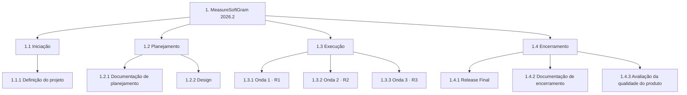

import useBaseUrl from '@docusaurus/useBaseUrl';

# Estrutura Analítica do Projeto (EAP)

## 1. Objetivo do documento

A **Estrutura Analítica do Projeto** (EAP, ou *Work Breakdown Structure*) é a
decomposição hierárquica de todo o trabalho a ser executado pela equipe para
entregar o produto. Ela não é um cronograma nem uma lista de tarefas: é o
inventário do **escopo**, organizado de forma que se possa verificar se algo
ficou de fora.

Neste projeto a EAP cumpre duas funções concretas:

1. É a origem da rastreabilidade exigida pela disciplina — as issues e
   sub-issues no ZenHub refletem seus pacotes de trabalho, pelo código numérico.
2. É o insumo da alocação: as **fatias verticais de funcionalidade** de cada onda
   definem a composição dos [squads por release](/docs/planejamento/squads).

## 2. Regras de construção adotadas

Três regras guiaram esta versão, e vale registrá-las porque elas explicam
escolhas que de outra forma pareceriam arbitrárias.

**Regra dos 100%.** A EAP contém todo o escopo do projeto, e nada além dele. Se um
trabalho não está aqui, ele não está no projeto. Isso obrigou a incluir itens que
uma primeira versão tende a esquecer — pipeline, ambientes de implantação, testes,
protótipos, manual de instalação — porque todos são cobrados nos critérios das
releases.

**Pacotes são entregas, não atividades.** Cada pacote de trabalho é nomeado por
aquilo que existe ao final dele, não pela ação de produzi-lo. "Quadro de
conhecimento e pareamentos" tem critério de conclusão verificável; "conhecer o
time" não tem.

**Planejamento em ondas sucessivas.** O escopo do MVP depende do sequenciador da
Lean Inception, que ainda não fechou. Em vez de inventar pacotes ou deixar caixas
vazias, os itens ainda não decomponíveis ficam registrados como **pacotes de
planejamento**, com critério e prazo de decomposição declarados — ver a
[seção 6](#6-pacotes-de-planejamento).

## 3. Artefato visual

<div style={{overflowX: 'auto', border: '1px solid var(--ifm-color-emphasis-300)', borderRadius: 8, background: '#fff'}}>
  
</div>

<p style={{fontSize: '0.85rem', marginTop: '0.5rem'}}>
  Figura 1 — EAP do MeasureSoftGram 2026.2.{' '}
  <a href={useBaseUrl('/img/eap-2026-2.svg')} target="_blank" rel="noopener">
    Abrir em tamanho real
  </a>
</p>

:::info Fonte editável
O diagrama é um **SVG**, e o Figma e o FigJam o importam nativamente: ao arrastar o
arquivo `static/img/eap-2026-2.svg` para dentro de um quadro, cada caixa vira um
objeto editável — texto, cor e posição.

Quando o quadro no FigJam existir, substitua a imagem acima pelo embed, mantendo o
SVG no repositório como versão canônica:

```html
<iframe src="https://www.figma.com/embed?embed_host=share&url=URL_DO_QUADRO"
        width="100%" height="600px" allowFullScreen></iframe>
```
:::

## 4. Visão geral



## 5. Decomposição

### 1.1 Iniciação

**Objetivo da fase:** estabelecer as condições para que o projeto possa ser
executado — escopo escolhido, time organizado, ambientes e repositórios prontos.
Não produz incremento de produto; produz a capacidade de produzir.

#### 1.1.1 Definição do projeto

| Código | Pacote de trabalho | Descrição |
|:---:|:---|:---|
| 1.1.1.1 | Registro do projeto e do parceiro | Projeto escolhido, organização parceira, Product Owner e o problema que o produto resolve, registrados na documentação. |
| 1.1.1.2 | Ambientes de trabalho configurados | GitHub, ZenHub, SonarCloud, Figma e Discord criados na organização da disciplina, com acesso para os 20 integrantes. |
| 1.1.1.3 | Plano de comunicação e rodízio de lideranças | Cerimônias com horário, formato e canal; calendário do rodízio quinzenal das lideranças de projeto, processo e produto; papéis de cada integrante. |
| 1.1.1.4 | Quadro de conhecimento e pareamentos | Matriz integrante × repositório, âncoras por repositório e regra de pareamento de entrada. Exigido na R1. |
| 1.1.1.5 | Diagnóstico do ecossistema herdado | Avaliação técnica dos repositórios de 2026.1 e o backlog técnico dela derivado. |
| 1.1.1.6 | Repositórios migrados e configurados | Merge de 2026.1 no repositório central e fork para 2026.2, um por componente, com licença, código de conduta e guia de contribuição. |
| 1.1.1.7 | Templates de issue e Pull Request | Templates de Tarefa, Defeito, US e PR nos repositórios. Exigido na R1. |

### 1.2 Planejamento

**Objetivo da fase:** produzir os artefatos que governam as três releases —
escopo decomposto, estimativas, custo, riscos, arquitetura e design.

#### 1.2.1 Documentação de planejamento

| Código | Pacote de trabalho | Descrição |
|:---:|:---|:---|
| 1.2.1.1 | Visão do Produto (Lean Inception) | Visão, personas, jornadas, brainstorming de funcionalidades, revisão técnica, **sequenciador** e Canvas MVP, validados com usuários reais. |
| 1.2.1.2 | EAP | Este documento: decomposição do escopo e sua manutenção ao longo do semestre. |
| 1.2.1.3 | Backlog do Produto | Épicos e histórias de usuário com critérios de aceitação, estimados e priorizados com o PO, ligados aos pacotes desta EAP. |
| 1.2.1.4 | Cronograma e planejamento de releases | Marcos das releases major e minor, calendário de sprints e roadmap no ZenHub. |
| 1.2.1.5 | Planilha de custos e EVM-Ágil | Modelo de custo, linha de base e cálculo de CPI, SPI e EAC a partir de horas reais individuais. |
| 1.2.1.6 | Matriz de riscos | Riscos com probabilidade, impacto, resposta e responsável, revisada a cada sprint. |
| 1.2.1.7 | Documento de Arquitetura | Arquitetura herdada e planejada, diagramas de componentes, implantação e entidade-relacionamento, e as decisões arquiteturais (ADRs). |
| 1.2.1.8 | Identidade visual | Guia de identidade visual do produto e da documentação. |

#### 1.2.2 Design

| Código | Pacote de trabalho | Descrição |
|:---:|:---|:---|
| 1.2.2.1 | Protótipos de alta fidelidade | Protótipos no Figma das funcionalidades priorizadas, validados com o cliente. Exigidos na R1 e evoluídos na R2. |

### 1.3 Execução

**Objetivo da fase:** entregar o incremento de produto de cada onda, implantado
em ambiente de homologação e validado com o cliente.

:::caution Decomposição parcial
As **fatias verticais de funcionalidade** de cada onda dependem do sequenciador
da Lean Inception (1.2.1.1), que ainda não fechou. Os pacotes abaixo marcados como
*pacote de planejamento* serão decompostos assim que ele for validado — ver a
[seção 6](#6-pacotes-de-planejamento).

Os demais pacotes desta fase **não dependem** da Lean Inception: são escopo já
conhecido, derivado do diagnóstico do ecossistema e dos critérios de avaliação
das releases.
:::

#### 1.3.1 Onda 1 — Release 1 (28/09)

| Código | Pacote de trabalho | Descrição |
|:---:|:---|:---|
| 1.3.1.1 | Estabilização do ecossistema herdado | Correção dos itens quebrados do diagnóstico e resolução da divergência entre o motor de cálculo publicado e o código versionado, de modo a tornar a nota de qualidade reproduzível. |
| 1.3.1.2 | Fundação técnica de CI/CD | Pipeline com lint, build, testes unitários e relatório SonarCloud; portões de qualidade bloqueantes; cobertura de testes unitários ≥ 85%. |
| 1.3.1.3 | Coleta automatizada de métricas | Geração automática do arquivo `.json` de métricas pelo pipeline, insumo do dashboard. |
| 1.3.1.4 | Ambiente de homologação | Ambiente de implantação em que a release é publicada na data da apresentação. |
| 1.3.1.5 | Dashboard Analítico DA-R1 | App Streamlit com os primeiros indicadores de processo e projeto: velocity, burndown, EVM-Ágil e matriz de riscos. |
| 1.3.1.6 | *Fatias verticais da onda 1* | **Pacote de planejamento.** |

#### 1.3.2 Onda 2 — Release 2 (26/10)

| Código | Pacote de trabalho | Descrição |
|:---:|:---|:---|
| 1.3.2.1 | Evolução da suíte de testes | Testes de integração incorporados ao pipeline, mantendo cobertura ≥ 85%. |
| 1.3.2.2 | Dashboard Analítico DA-R2 | Métricas de qualidade de produto normalizadas, ponderadas, agregadas e interpretadas pela equipe; comparação R1 × R2. |
| 1.3.2.3 | Testes de aceitação das histórias da onda | Execução e documentação da aceitação das histórias pelo cliente. |
| 1.3.2.4 | *Fatias verticais da onda 2* | **Pacote de planejamento.** |

#### 1.3.3 Onda 3 — Release 3 (30/11)

| Código | Pacote de trabalho | Descrição |
|:---:|:---|:---|
| 1.3.3.1 | Suíte de testes completa | Testes unitários, de integração, de sistema e de GUI, com cobertura ≥ 90%. |
| 1.3.3.2 | Dashboard Analítico DA-R3 e Canvas Analytics | Forma final do dashboard, com síntese visual do semestre e análise planejado × realizado. |
| 1.3.3.3 | MVP validado pelos Product Owners | Produto implantado em produção ou homologação, com validação formal registrada. |
| 1.3.3.4 | *Fatias verticais da onda 3* | **Pacote de planejamento.** |

### 1.4 Encerramento

**Objetivo da fase:** encerrar o projeto formalmente — aceitação pelo cliente,
documentação final e avaliação da qualidade do que foi entregue.

#### 1.4.1 Release Final (RF — 07/12)

| Código | Pacote de trabalho | Descrição |
|:---:|:---|:---|
| 1.4.1.1 | Testes de aceitação com o cliente | Execução e documentação formal da aceitação final. |
| 1.4.1.2 | Reforço de segurança do produto | Revisão e correção de vulnerabilidades antes da entrega final. |

#### 1.4.2 Documentação de encerramento

| Código | Pacote de trabalho | Descrição |
|:---:|:---|:---|
| 1.4.2.1 | Relatório de Encerramento | Relatório final, com a seção obrigatória *"Como usamos IA neste semestre"*. |
| 1.4.2.2 | Manual de instalação do produto | Guia de instalação e uso destinado ao usuário final. |
| 1.4.2.3 | Gerência de configuração consolidada | Política de branching aplicada, merges, releases com tags e conformidade com padrões de software livre. |

#### 1.4.3 Avaliação da qualidade do produto

| Código | Pacote de trabalho | Descrição |
|:---:|:---|:---|
| 1.4.3.1 | Análise planejado × realizado | Comparação em custo (EVM), tempo, escopo e qualidade, com análise das causas dos desvios. |
| 1.4.3.2 | Avaliação final da qualidade | Avaliação do produto à luz do modelo de qualidade adotado, com o histórico de evolução das métricas. |
| 1.4.3.3 | Retrospectiva crítica do uso de IA | O que a IA acertou, o que errou e onde o julgamento humano foi indispensável ao longo do semestre. |

## 6. Pacotes de planejamento

Os pacotes `1.3.1.6`, `1.3.2.4` e `1.3.3.4` são **pacotes de planejamento**: escopo
reconhecido, ainda não decomposto em pacotes de trabalho.

| Item | Depende de | Critério de decomposição | Prazo |
| --- | --- | --- | --- |
| 1.3.1.6 Fatias verticais da onda 1 | 1.2.1.1 Sequenciador da Lean Inception | Sequenciador validado com o PO e Canvas MVP fechado | Antes do planejamento da sprint que abre a R1 |
| 1.3.2.4 Fatias verticais da onda 2 | 1.3.1.6 e feedback da R1 | Retrospectiva da R1 e repriorização do backlog | Até 05/10 |
| 1.3.3.4 Fatias verticais da onda 3 | 1.3.2.4 e feedback da R2 | Retrospectiva da R2 e repriorização do backlog | Até 09/11 |

Cada fatia, quando criada, precisa ser **vertical e demonstrável**: algo que se
mostra ao PO ao final da onda, atravessando quantos repositórios forem
necessários — e não "mexer no Core". É essa forma que permite formar os
[squads por release](/docs/planejamento/squads).

:::warning Risco associado
O sequenciador estava previsto para a semana 3 do
[cronograma](/docs/disciplina/cronograma) (24/08) e ainda não fechou. A R1 é em
28/09 e exige Visão do Produto validada, backlog priorizado e protótipos de alta
fidelidade — todos a jusante dele. Este é um risco **já materializado** e está
registrado em [Riscos](/docs/planejamento/riscos).
:::

## 7. Rastreabilidade

O detalhamento operacional — sprints, status, responsáveis, issues e pull
requests — é mantido no **ZenHub** e no **GitHub**, e não é duplicado aqui. A
ligação entre os dois se dá pelo código do pacote de trabalho:

```
EAP (fase)     → Épico no ZenHub
EAP (pacote)   → Issue
Decomposição   → Sub-issue
```

Toda issue deve indicar o código do pacote a que pertence. Uma issue que não se
mapeia de volta para um pacote desta EAP é sinal de escopo não planejado — o que
pode ser legítimo, mas exige atualizar a EAP em vez de ignorá-la.

## 8. Política de atualização

Este documento é atualizado apenas em caso de **mudança estrutural de escopo**:
inclusão, exclusão ou reorganização de pacotes de trabalho, e a decomposição dos
pacotes de planejamento da seção 6.

Alterações operacionais — redistribuição de tarefas entre sprints, mudança de
responsável, atualização de status, fechamento de issue — **não** são refletidas
aqui. Elas vivem no ZenHub.

Toda alteração estrutural entra no histórico de versão abaixo.

## 9. Referências

- PMI. *A Guide to the Project Management Body of Knowledge (PMBOK Guide)* —
  decomposição de escopo, regra dos 100% e planejamento em ondas sucessivas.
- NORMAN, E. S.; BROTHERTON, S. A.; FRIED, R. T. **Work Breakdown Structures: The
  Foundation for Project Management Excellence**. John Wiley, 2011.
- CAROLI, P. **Lean Inception: como alinhar pessoas e construir o produto certo** —
  origem do sequenciador que define as ondas.
- [EAP 2026.1](https://github.com/fga-eps-mds/2026.1-MeasureSoftGram-DOC/blob/main/docs/produto/eap.md) —
  versão do semestre anterior, mantida como registro da evolução do documento.

## 10. Histórico de versão

| Versão | Data | Descrição | Autor | Revisor |
| --- | --- | --- | --- | --- |
| 1.0 | 10/09/2026 | Criação da EAP 2026.2 em quatro fases, com codificação numérica e pacotes de planejamento para as ondas do MVP | [@MilenaFRocha](https://github.com/MilenaFRocha) | |
