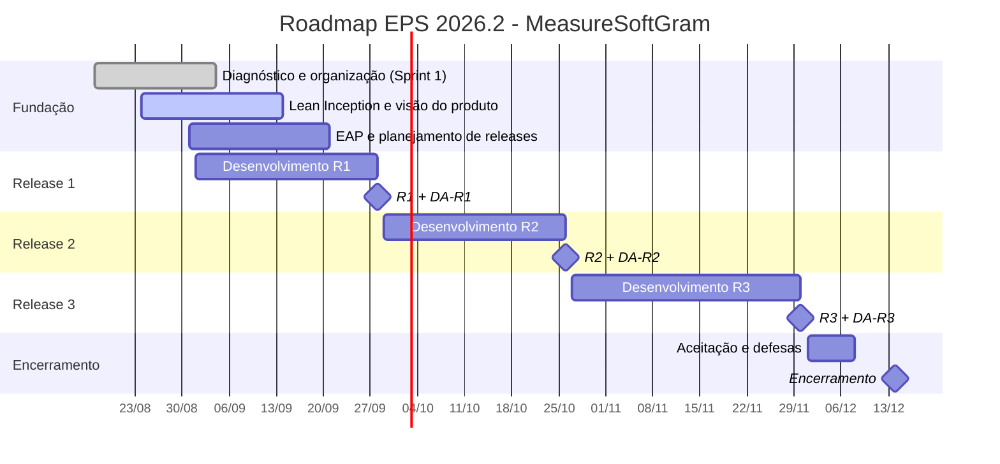

# Roadmap do semestre

As datas abaixo vêm do [cronograma da disciplina](/docs/disciplina/cronograma).
Os **marcos são fixos**; o que a equipe planeja é o escopo que entra em cada um.

## Linha do tempo

## Marcos

| Marco | Data | Entrega associada | Escopo planejado |
| --- | --- | --- | --- |
| **Release 1** | 28/09/2026 | Planejamento, arquitetura, pipelines, dashboard v1, ambientes de implantação, Visão do Produto | *a definir na EAP* |
| **MD-R1** | 29/09/2026 | Memorando de Decisão individual — planejamento | Individual |
| **Release 2** | 26/10/2026 | Incremento funcional, qualidade, dashboard v2 | *a definir na EAP* |
| **MD-R2** | 27/10/2026 | Memorando de Decisão individual — qualidade | Individual |
| **Release 3** | 30/11/2026 | MVP validado pelos POs, dashboard e analytics completos | *a definir na EAP* |
| **Release Final** | 07/12/2026 | Testes de aceitação com o cliente e defesas orais | Time |
| **MD-R3** | 08/12/2026 | Memorando de Decisão individual — encerramento | Individual |

Critérios detalhados de cada release em
[Avaliação e entregas](/docs/disciplina/avaliacao).

## Ondas de escopo

O escopo de cada release é organizado em **ondas** na Estrutura Analítica do
Projeto (EAP), e são essas ondas que definem os
[squads da release](/docs/planejamento/squads).

:::caution EAP pendente
A EAP de 2026.2 ainda não foi construída. Ela depende da Lean Inception e do
sequenciador de funcionalidades validados com o PO. Enquanto isso, a tabela
abaixo fica em aberto.
:::

### Onda 1 — Release 1

| Código | Pacote de trabalho | Descrição | Squad |
| --- | --- | --- | --- |
| | | | |

### Onda 2 — Release 2

| Código | Pacote de trabalho | Descrição | Squad |
| --- | --- | --- | --- |
| | | | |

### Onda 3 — Release 3

| Código | Pacote de trabalho | Descrição | Squad |
| --- | --- | --- | --- |
| | | | |

## Releases minor

Além dos três marcos major, a disciplina espera **releases minor** — versões
parciais entregues ao longo das sprints, como evidência de ritmo sustentável.
Registrar cada uma no Aprender 3 e na página de [Sprints](/docs/sprints).

| Release minor | Sprint | Data | O que foi entregue |
| --- | --- | --- | --- |
| | | | |

## Histórico de versão

| Versão | Data | Descrição | Autor | Revisor |
| --- | --- | --- | --- | --- |
| 1.0 | 10/09/2026 | Datas reais do cronograma 2026.2 e estrutura de ondas | [@MilenaFRocha](https://github.com/MilenaFRocha) | |
