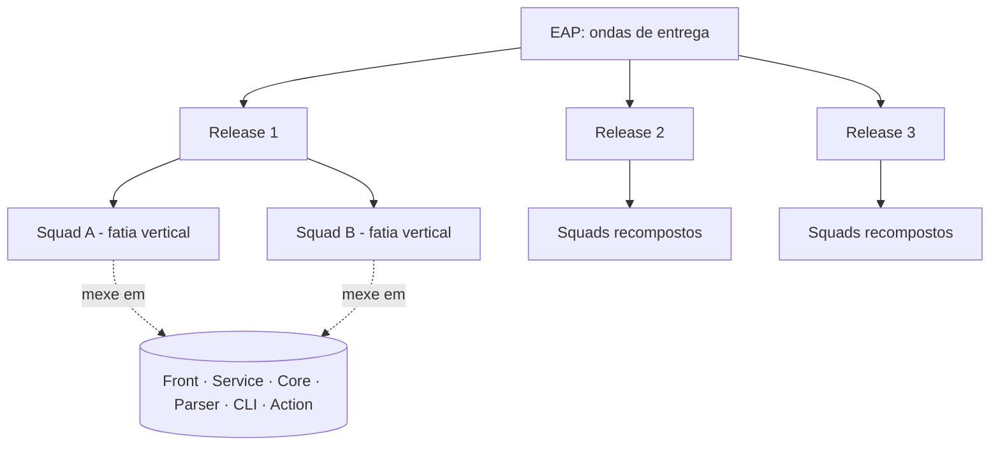

# Organização em squads por feature/release

## A decisão

Em 2026.1 a equipe se organizou em **clãs por repositório** — cada grupo dono de
uma camada da arquitetura (Action, CLI, Web). Em 2026.2 adotamos um modelo
diferente: **squads temporários formados por onda/release**, não por repositório.

Cada squad recebe uma **fatia vertical de funcionalidade** e mexe em **quantos
repositórios forem necessários** para entregar aquilo ponta a ponta.

### Por que mudamos

| | |
| --- | --- |
| ✅ | **Resolve o desbalanceamento de carga.** No modelo por repositório, o volume de trabalho de uma release não se distribui igualmente entre as camadas: um clã fica sobrecarregado enquanto outro fica ocioso. Com squads por feature, a alocação segue o trabalho, e não o contrário. |
| ✅ | **Todo mundo aprende mais repositórios.** Como cada squad atravessa a stack para entregar sua fatia, ao longo das três releases os integrantes passam por partes diferentes do sistema. Isso é um objetivo da disciplina, não um efeito colateral. |
| ⚠️ | **Exige mais coordenação técnica.** Alguém vai mexer num repositório onde nunca trabalhou. Sem contrapartida, isso vira retrabalho e PR travado. As contramedidas estão em [Como mitigamos o risco](#como-mitigamos-o-risco). |

A composição dos squads é **refeita a cada release**, acompanhando as ondas da
[EAP](/docs/planejamento/eap) e o [planejamento de releases](/docs/planejamento/roadmap).

## Como funciona

### Regras do modelo

1. **A fatia é vertical e entregável.** Um squad só é formado em torno de algo que
   pode ser demonstrado ao PO ao final da release — não em torno de "mexer no
   Core".
2. **A composição vale por uma release.** Ao final de cada release major os
   squads são desfeitos e recompostos conforme a onda seguinte.
3. **Cada squad tem um responsável de squad.** Não é um cargo: é quem responde
   pelo andamento da fatia, acompanha as issues no ZenHub e leva os bloqueios
   para a reunião do time. O papel gira junto com a
   [rotatividade de lideranças](/docs/disciplina#rotatividade-das-lideranças)
   exigida pela disciplina.
4. **Cada repositório tem pelo menos um *conhecedor* alocado.** Ver
   [Como mitigamos o risco](#como-mitigamos-o-risco).
5. **Rastreabilidade no ZenHub.** Cada squad é uma label/épico no board, e cada
   issue da fatia é filha dele. Nenhuma alocação existe só nesta página.

## Alocação por release

> Preencher após a definição da EAP e do planejamento de releases.

### Release 1 — 28/09

| Squad | Fatia de funcionalidade (o que entrega) | Repositórios envolvidos | Responsável | Integrantes |
| --- | --- | --- | --- | --- |
| Squad A | | | | |
| Squad B | | | | |
| Squad C | | | | |

**Dependências entre squads**

| De | Para | O que | Prazo acordado |
| --- | --- | --- | --- |
| | | | |

### Release 2 — 26/10

| Squad | Fatia de funcionalidade (o que entrega) | Repositórios envolvidos | Responsável | Integrantes |
| --- | --- | --- | --- | --- |
| | | | | |

**Dependências entre squads**

| De | Para | O que | Prazo acordado |
| --- | --- | --- | --- |
| | | | |

### Release 3 — 30/11

| Squad | Fatia de funcionalidade (o que entrega) | Repositórios envolvidos | Responsável | Integrantes |
| --- | --- | --- | --- | --- |
| | | | | |

**Dependências entre squads**

| De | Para | O que | Prazo acordado |
| --- | --- | --- | --- |
| | | | |

## Como mitigamos o risco

O custo do modelo é coordenação técnica entre pessoas que não conhecem o
repositório em que vão mexer. As contramedidas combinadas pela equipe:

| Prática | Como funciona | Status |
| --- | --- | --- |
| **Âncora por repositório** | Cada repositório tem uma ou duas pessoas de referência, que não "são donas" dele, mas respondem dúvidas e revisam PRs de quem chega de fora. A âncora muda entre releases para não recriar silos. | A definir |
| **Pareamento na entrada** | A primeira tarefa de alguém num repositório novo é feita em par com quem já mexeu nele. | A definir |
| **Onboarding por repositório** | Guia curto de como rodar e testar localmente cada repositório, mantido na documentação. | A definir |
| **Revisão cruzada obrigatória** | Todo PR precisa de aprovação de alguém de fora do squad autor. | A definir |
| **Quadro de conhecimento** | Matriz pessoa × repositório atualizada a cada release, para enxergar concentração de conhecimento e planejar a rotação. É exigência da R1. | A definir |

:::tip Registre o efeito, não só a intenção
Este modelo é uma decisão gerencial: ele rende **Memorando de Decisão**. Ao final
de cada release, registre em [Sprints](/docs/sprints) o que a troca de squads
custou (retrabalho, PRs parados, tempo de rampa) e o que ela rendeu (distribuição
de carga, pessoas novas em cada repositório). Sem essa medição, a decisão vira
opinião.
:::

## Quadro de conhecimento

Matriz de quem já trabalhou em cada repositório. Atualizar ao final de cada
release. Legenda: 🟢 confortável · 🟡 já mexeu · ⚪ nunca mexeu.

| Integrante | Core | Parser | Service | Front | CLI | Action | Docs |
| --- | --- | --- | --- | --- | --- | --- | --- |
| | | | | | | | |

O mapeamento de competências gerais fica na aba **habilidades** da
[planilha da equipe](https://docs.google.com/spreadsheets/d/1iucrFAgDsj8adfkzzcUfnMIkJwoAVVHPLkpdJ8lDSHc/edit?usp=sharing).

## Referências

- KNIBERG, H.; IVARSSON, A. **Scaling Agile @ Spotify with Tribes, Squads,
  Chapters & Guilds**, 2012 —
  [PDF](http://blog.crisp.se/wp-content/uploads/2012/11/SpotifyScaling.pdf).
  Base do modelo de squads; aqui adaptado com composição temporária por release em
  vez de squads permanentes por área.
- COHN, M. **Succeeding with Agile**, cap. 1–3 (formação e evolução de times).
- [Metodologia de clãs adotada em 2026.1](https://github.com/fga-eps-mds/2026.1-MeasureSoftGram-DOC) —
  modelo anterior, mantido como registro da evolução da decisão.

## Histórico de versão

| Versão | Data | Descrição | Autor | Revisor |
| --- | --- | --- | --- | --- |
| 1.0 | 10/09/2026 | Criação do documento com o modelo de squads por feature/release | [@MilenaFRocha](https://github.com/MilenaFRocha) | |
