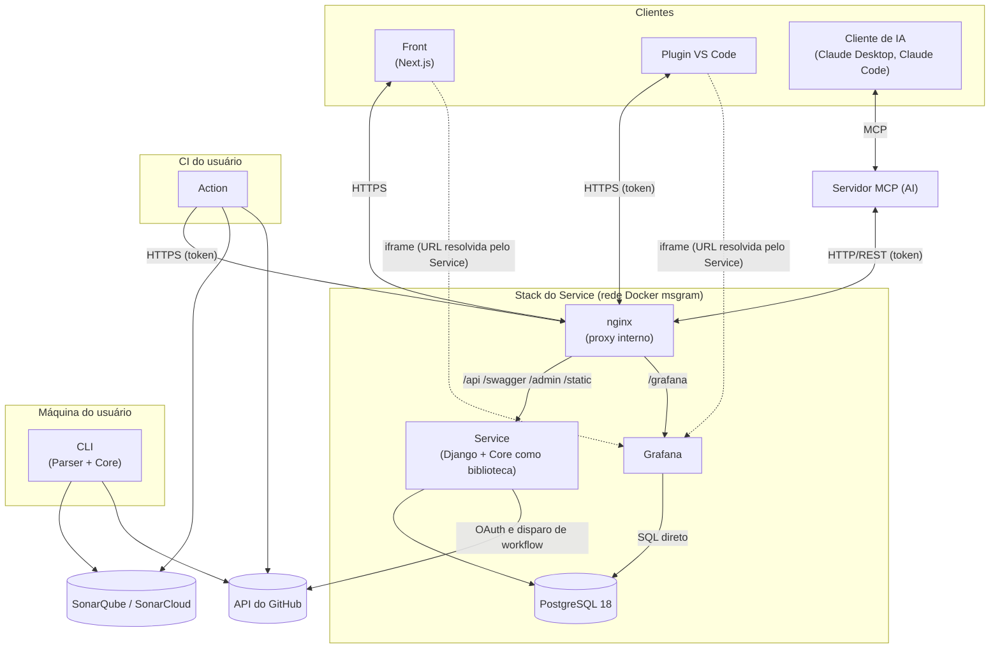
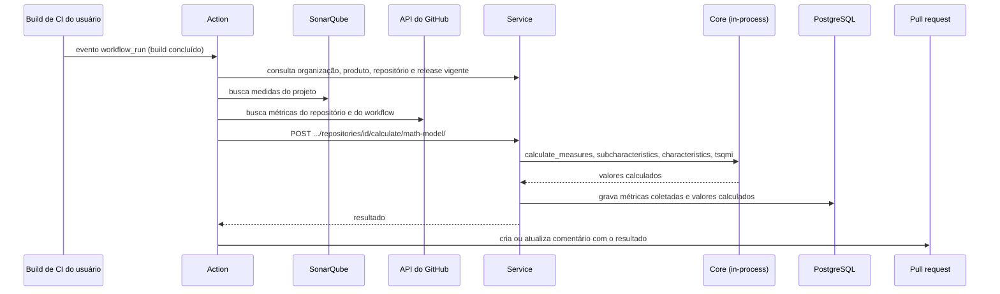
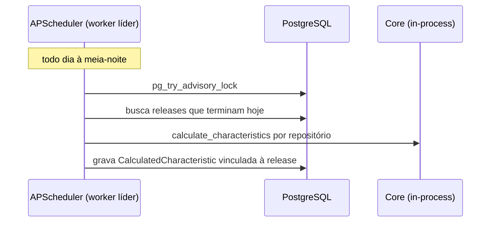
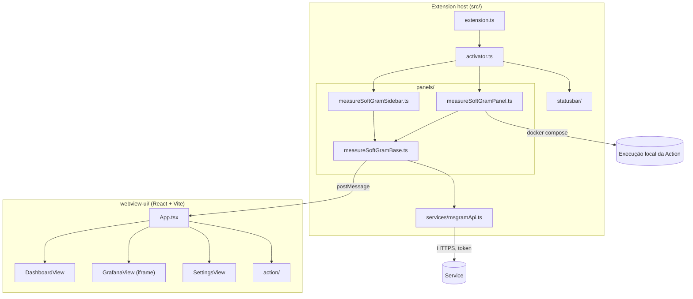
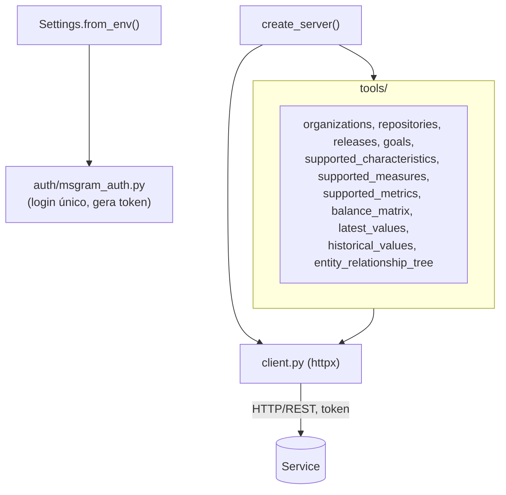
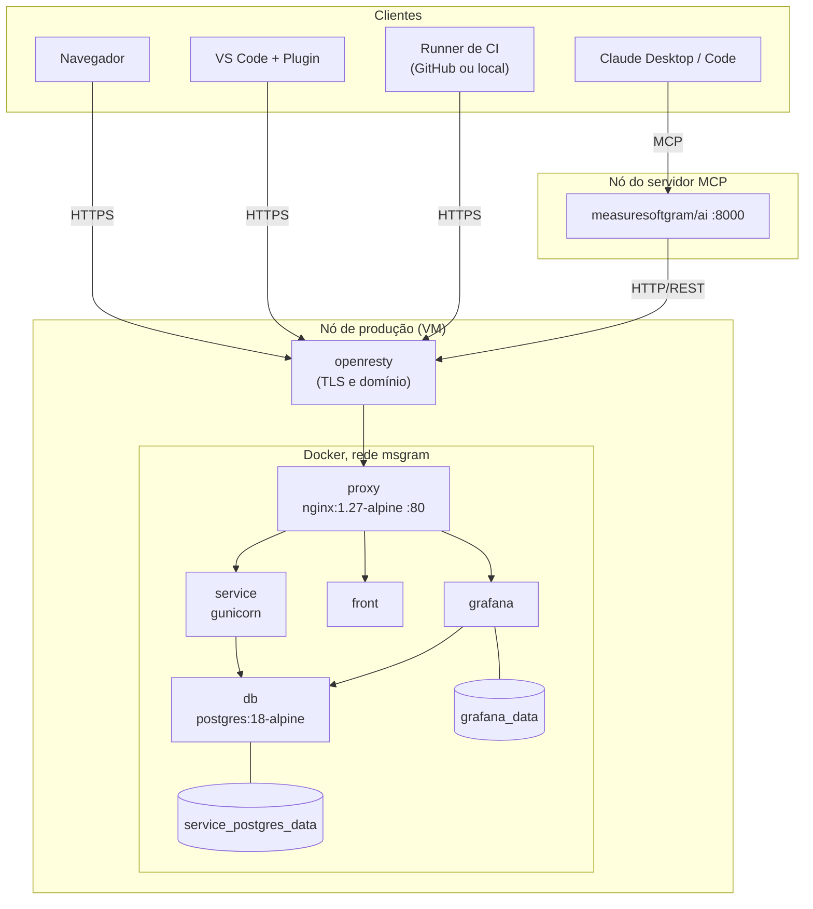
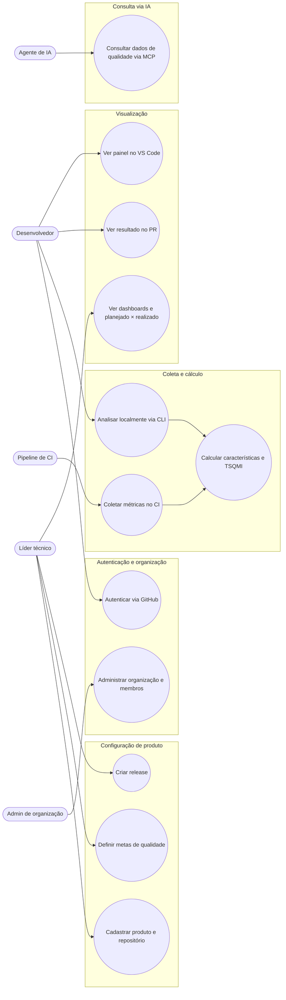
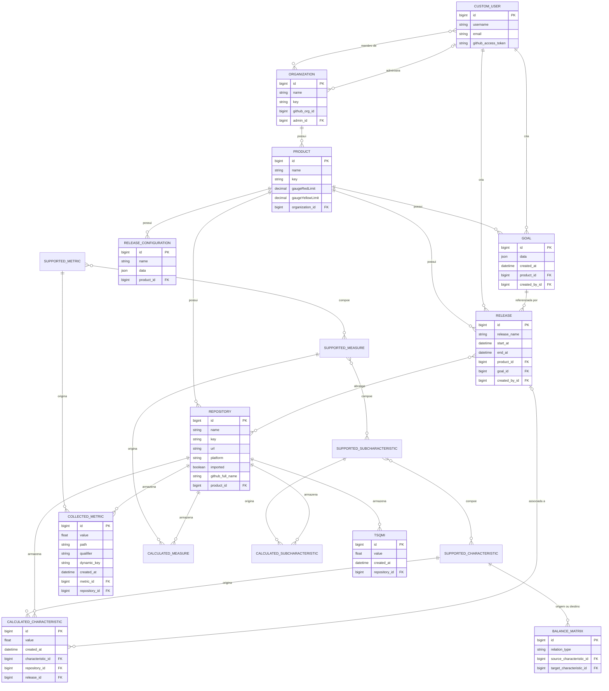

# Arquitetura

Este documento descreve a arquitetura do MeasureSoftGram no semestre 2026.2: os componentes
do ecossistema, as tecnologias de cada um, como se comunicam em tempo de execução, como são
implantados e como os dados são modelados.

:::info Base e verificação

Este documento parte do
[documento de arquitetura de 2026.1](https://github.com/fga-eps-mds/2026.1-MeasureSoftGram-DOC/blob/main/docs/planejamento/arquitetura.md)
e foi conferido em **27/09/2026** contra a branch `develop` dos repositórios `2026.2-*`, que
são a linha de desenvolvimento ativa (ver [Diagnóstico](../diagnostico/diagnostico.mdx)).
Onde o código atual diverge do documento anterior, vale o código.

:::

## Visão geral

A arquitetura está organizada segundo o modelo **4+1 de Philippe Kruchten**:

- **Visão lógica:** componentes do sistema, responsabilidades e comunicação entre eles.
- **Visão de processo:** concorrência, distribuição e comunicação entre processos em execução.
- **Visão de desenvolvimento:** organização do código-fonte em repositórios, módulos e pacotes.
- **Visão física:** mapeamento dos componentes nos nós de infraestrutura.
- **Visão de casos de uso (+1):** cenários que exercitam e validam as demais visões.

Além das visões, o documento apresenta o modelo de dados, os pontos de atenção
arquiteturais, o impacto do MVP de 2026.2, as metas e restrições e as decisões arquiteturais.

### Princípios da arquitetura atual

- **O cálculo de qualidade é uma biblioteca, não um serviço.** O Core implementa o modelo
  matemático e é importado por quem precisa calcular (Service e CLI). Não há chamada de rede
  para calcular.
- **O Service é o ponto de acesso aos dados.** Front, Plugin, Action e MCP falam com o
  Service por HTTP. A exceção é o Grafana, que lê o banco diretamente.
- **A coleta acontece fora do Service.** As métricas são extraídas no CI do usuário (Action)
  ou na máquina do usuário (CLI), a partir do SonarQube e do GitHub.

## Componentes e tecnologias

| Componente | Responsabilidade | Tecnologia | Distribuição |
| --- | --- | --- | --- |
| Core | Modelo matemático de qualidade: medidas, subcaracterísticas, características e TSQMI | Python 3.10+, pandas, numpy, marshmallow | PyPI `msgram_core` (1.5.5rc1 no `develop`) |
| Parser | Extração e normalização de métricas do SonarQube (estático) e do GitHub (dinâmico), por plugins | Python 3.9+, pandas, requests | PyPI `msgram-parser` (1.2.3rc1) |
| Service | API REST, autenticação, persistência, cálculo via Core, job diário de releases e autorização dos dashboards | Django 5.2, DRF 3.18, django-allauth, APScheduler, gunicorn, Python 3.12, uv | Imagem Docker própria (DockerHub) |
| Front | Interface web: organizações, produtos, repositórios, releases e dashboards | Next.js 12.2, React 18, MUI 5, ECharts, TypeScript, pnpm | Imagem Docker própria (DockerHub) |
| CLI | Extração e cálculo local, sem acesso ao Service | Python 3.9+ | PyPI `msgram` (3.3.1rc2) |
| Action | Coleta métricas no CI do usuário, envia ao Service e comenta o resultado no PR | TypeScript, `@actions/*`, octokit, axios, runtime node20 | GitHub Action |
| Plugin | Painel de qualidade, dashboards e execução local da Action dentro do VS Code | TypeScript (extension host) + React e Vite (webview) | Extensão VS Code (1.0.2) |
| AI (MCP) | Expõe os dados do Service a clientes de IA pelo protocolo MCP | Python 3.11+, SDK `mcp` (FastMCP), httpx | Imagem Docker `measuresoftgram/ai` |
| Grafana | Dashboards analíticos lidos direto do banco e incorporados por iframe | Grafana com plugin `volkovlabs-echarts-panel` | Container de terceiros |
| PostgreSQL | Persistência do Service | PostgreSQL 18 (`postgres:18-alpine`) | Container |

:::warning Versões do Core desalinhadas

Cada consumidor usa uma versão diferente do Core: o Service fixa `msgram-core==1.4.9`, a CLI
declara `msgram-core~=1.5.3` e o Core está em `1.5.5rc1`. Por isso o Service mantém um
substituto provisório da medida `technical_debt_ratio` (`utils/core_compat.py`), a ser
removido quando ele for atualizado para o Core 1.5.5 ou superior.

:::

### Infraestrutura do Service

A stack do Service é orquestrada por dois arquivos Docker Compose: `docker-compose.yml`
(desenvolvimento) e `deploy/docker-compose.prod.yml` (produção).

| Container | Imagem | Observações |
| --- | --- | --- |
| `db` | `postgres:18-alpine` | Volume `service_postgres_data`. Em desenvolvimento publica a porta 5432 só em `127.0.0.1`; em produção não publica porta. |
| `service` | Dev: build local (multi-stage, builder com uv e runtime `python:3.12-slim-bookworm`). Prod: imagem do DockerHub. | gunicorn com `GUNICORN_WORKERS` (padrão 3). Healthcheck controla a ordem de subida. |
| `front` | Imagem do DockerHub (só no compose de produção) | Sobe junto com a stack em produção. |
| `grafana` | `grafana/grafana:latest` | Volume `grafana_data`; dashboards e datasource provisionados por arquivo. |
| `proxy` | `nginx:1.27-alpine` (só em produção) | Único container que publica porta no host (`80:80`). |

Em produção, os containers ficam na rede bridge `msgram`. O nginx interno fica atrás de um
proxy externo da máquina (openresty), responsável pelo domínio e pelo TLS, e roteia por
caminho:

| Rota | Destino |
| --- | --- |
| `/api/`, `/swagger/`, `/admin/`, `/static/` | `service:8080` (Django) |
| `/grafana/` | `grafana:3000`, com upgrade para WebSocket |
| `/` | `front` (Next.js) |

### Integração com o Grafana

O Grafana consulta o **mesmo PostgreSQL do Service diretamente**, sem passar pela API. Para
ser incorporado por iframe, ele roda com acesso anônimo somente leitura
(`GF_AUTH_ANONYMOUS_ENABLED`, papel `Viewer`) e `GF_SECURITY_ALLOW_EMBEDDING=true`.

Como o Grafana é aberto para leitura, o controle de acesso fica no Service, no app
`grafana_proxy`:

- `GET /api/v1/grafana/dashboards/` lista os dashboards disponíveis.
- `GET /api/v1/grafana/dashboard/<uid>/` valida se o usuário tem acesso ao produto e ao
  repositório informados e devolve a URL do dashboard já filtrada, usada como `src` do iframe.

Front e Plugin nunca chamam o Grafana para autorização: sempre pedem a URL ao Service.

:::note Retirada do Grafana

A retirada do Grafana está planejada para o MVP de 2026.2 (ver
[Impacto do MVP na arquitetura](#impacto-do-mvp-na-arquitetura)). Enquanto isso não
acontece, esta seção descreve o estado vigente.

:::

## Visão lógica



Pontos centrais da visão lógica:

- **Core** é importado dentro do processo do Service. O Service usa as funções
  `calculate_measures`, `calculate_subcharacteristics`, `calculate_characteristics` e
  `calculate_tsqmi`, além de `diff` e `norm_diff` para comparar planejado e realizado.
- **Parser** é consumido apenas pela CLI. O Service não depende dele.
- **CLI** não se comunica com o Service: extrai, calcula e grava o resultado localmente.
- **Action** coleta métricas do SonarQube e do GitHub e envia ao Service, que calcula e
  persiste.
- **Autenticação:** usuários entram via OAuth do GitHub (django-allauth). A API REST usa
  `TokenAuthentication` do DRF, que também é o mecanismo usado pela Action, pelo Plugin e pelo
  MCP.

## Visão de processo

O MeasureSoftGram **não usa fila de mensagens nem broker** (não há Celery, Redis ou RabbitMQ).
A comunicação entre processos de rede é síncrona (request/response), e a concorrência
existente roda dentro do processo do Service.

### Processos de longa duração

| Processo | Natureza | Comunicação |
| --- | --- | --- |
| Service | gunicorn (WSGI síncrono), modelo prefork com `GUNICORN_WORKERS` processos (padrão 3) | HTTP/REST síncrono |
| Grafana | Container com ciclo de vida próprio | SQL direto no PostgreSQL |
| Servidor MCP | Container HTTP (porta 8000) | Recebe chamadas MCP e as traduz em chamadas HTTP síncronas ao Service |
| Front | Servidor Next.js | Chama a API do Service |

### Concorrência dentro do Service

Existem dois mecanismos, ambos internos ao processo Django:

1. **Job agendado diário (APScheduler).** O app `releases` registra um `BackgroundScheduler`
   no boot de cada worker. O job `get_releases_and_create_results` roda à meia-noite
   (`America/Sao_Paulo`) e calcula as características das releases que terminam no dia. Para
   não rodar uma vez por worker, o primeiro worker que obtém um advisory lock do PostgreSQL
   (`pg_try_advisory_lock`, em `releases/jobs.py`) vira o dono do scheduler; os demais não
   agendam nada.
2. **Thread de onboarding na criação de repositório.** Ao cadastrar um repositório, o Service
   dispara uma `threading.Thread` com `daemon=True` (`organizations/views.py`). Ela tenta
   acionar um workflow do GitHub Actions do usuário pela API do GitHub e, se não conseguir,
   gera métricas simuladas para a interface não ficar vazia. Não há fila, persistência nem
   retentativa: se o worker reiniciar durante a execução, a tarefa se perde.

### Fluxo de coleta e cálculo



### Job diário de releases



### Processos efêmeros

- **Action:** cada execução é um runner novo (hospedado no GitHub, ou local via Docker quando
  disparada pelo Plugin), que termina ao fim da análise.
- **CLI:** cada comando roda até concluir e encerra.

## Visão de desenvolvimento

Cada módulo vive em um repositório próprio na organização
[fga-eps-mds](https://github.com/fga-eps-mds). A linha ativa é a dos repositórios `2026.2-*`
(ver [Repositórios](./repositorios.mdx)).

### Core

```
src/
├── core/
│   ├── aggregated_normalized_measures.py   # medidas normalizadas e agregadas
│   ├── measures_functions.py
│   ├── schemas.py                          # validação de entrada (marshmallow)
│   └── transformations.py                  # diff, norm_diff e transformações do modelo
├── resources/
│   ├── analysis.py      # calculate_measures, _subcharacteristics, _characteristics, _tsqmi
│   └── constants.py
├── staticfiles/         # catálogo de métricas, medidas e características suportadas
└── util/
```

Os pacotes são publicados com nomes genéricos de nível superior (`core`, `resources`,
`staticfiles`, `util`), e é assim que o Service os importa.

### Parser

```
genericparser/
├── genericparser.py       # ponto de entrada
├── accept_plugins.py      # registro de plugins
├── services/
└── plugins/
    ├── domain/            # classe base dos plugins
    ├── statics/sonarqube.py
    └── dinamic/github.py  # consulta a API do GitHub
```

### CLI

Comandos em `src/cli/commands/`: `init`, `demo`, `list` (configuração), `extract`,
`calculate`, `diff` e `norm_diff`. A extração aceita arquivos do SonarQube e dados do GitHub.

### Service

Projeto Django em `src/`, com um app por entidade do domínio:

| App | Responsabilidade |
| --- | --- |
| `accounts` | Usuário customizado, login via GitHub, tokens |
| `organizations` | Organizações, produtos e repositórios; onboarding de repositório |
| `metrics` | Métricas suportadas e coletadas |
| `measures`, `subcharacteristics`, `characteristics` | Entidades suportadas e valores calculados de cada nível do modelo; matriz de balanceamento |
| `tsqmi` | Nota final de qualidade |
| `goals` | Metas de qualidade (equalizador) |
| `releases` | Releases e job diário de cálculo |
| `release_configuration` | Configuração do modelo por produto |
| `math_model` | Endpoint de cálculo usado pela Action |
| `entity_trees` | Árvore de relacionamento entre entidades de qualidade |
| `grafana_proxy` | Autorização e resolução de URLs dos dashboards |
| `utils` | Utilitários e compatibilidade com o Core |

### Front

```
src/
├── pages/        # rotas Next.js: auth, home, landing, organizations, products, config, about
├── components/
├── mocks/
└── shared/       # components, contexts, hooks, layouts, services, utils, customTypes
```

### Action

```
src/
├── index.ts               # orquestra o fluxo
├── sonarqube.ts           # coleta no SonarQube
├── github.ts              # coleta na API do GitHub e comentário no PR
├── service/               # cliente HTTP do Service
└── utils.ts
```

### Plugin VS Code

O Plugin tem dois projetos: o host da extensão (`src/`) e uma aplicação React e Vite
(`webview-ui/`) empacotada dentro da extensão. Eles se comunicam por `postMessage`; a webview
nunca chama o Service diretamente.



Para executar a Action localmente, o Plugin salva o workflow no workspace do usuário e sobe
um `docker compose` empacotado na extensão (`resources/docker`) em um terminal do VS Code.

### Servidor MCP (AI)

O pacote `msgram_mcp` monta o servidor FastMCP em `server.py` e registra as tools de cada
módulo de `tools/`, que usam um cliente HTTP compartilhado (`client.py`) para consultar o
Service. O transporte padrão é `streamable-http`, com `sse` como alternativa
(`MCP_TRANSPORT`).



A autenticação usa uma conta de serviço fixa (`SERVICE`, `MSGRAM_USER`, `MSGRAM_PASSWORD`):
o token é obtido uma vez na subida e reaproveitado por todas as tools. O MCP não repassa a
identidade de quem usa o agente de IA.

### Grafana

O Grafana não tem código próprio: é provisionado por arquivos no repositório do Service.

```
grafana/
├── dashboards/            # dashboards em JSON
├── provisioning/
│   ├── datasources/       # datasource PostgreSQL (mesmo banco do Service)
│   └── dashboards/        # provider que carrega os JSONs
└── seed_planejado_vs_realizado.sql
```

## Visão física



Em desenvolvimento não há nginx nem openresty: o Service publica a porta 8080, o Grafana
publica a porta 5000 mapeada para 3000, e o banco fica só em `127.0.0.1:5432`.

:::note Ambiente de produção

A topologia acima é a descrita em `deploy/docker-compose.prod.yml`. O diagnóstico de 19/09
registra que o ambiente de produção em execução não pôde ser verificado (item MSG-40).

:::

## Visão de casos de uso

### Atores

| Ator | Descrição |
| --- | --- |
| Desenvolvedor | Consome dados de qualidade pelo Front, pela CLI, pelo Plugin ou no comentário do PR |
| Líder técnico | Configura produtos, repositórios, releases e metas; analisa planejado × realizado |
| Administrador de organização | Administra a organização e seus membros |
| Pipeline de CI | Ator de sistema: dispara a coleta ao fim do build |
| Agente de IA | Consulta dados de qualidade em linguagem natural via MCP |

### Diagrama de casos de uso



## Modelo de dados

O modelo abaixo foi extraído dos `models.py` do Service. Tabelas de infraestrutura de
terceiros (autenticação do Django, `authtoken`, `allauth`, `django_apscheduler`) ficam fora do
escopo. Os apps `grafana_proxy`, `entity_trees` e `math_model` não têm modelos próprios. Para
legibilidade, o diagrama mostra os atributos das entidades principais.



Observações sobre o modelo:

- **Mudança desde 2026.1:** `Release` ganhou a relação N:M `repositories` com `Repository`
  (migração `releases/0003_release_repositories`), que define quais repositórios compõem uma
  release.
- **Métricas coletadas não se ligam a release.** `CollectedMetric`, `CalculatedMeasure`,
  `CalculatedSubCharacteristic` e `TSQMI` conhecem só o repositório e a data. Apenas
  `CalculatedCharacteristic` tem FK para `Release`. A agregação por release é feita por janela
  de tempo (`start_at` a `end_at`), não por vínculo.
- **Rastreabilidade até o arquivo já tem base no modelo.** `CollectedMetric` guarda `path` e
  `qualifier`, o que permite associar métricas a arquivos de código-fonte.
- `Goal` e `ReleaseConfiguration` usam querysets imutáveis: uma nova meta ou configuração gera
  um novo registro em vez de alterar o anterior.
- `Release` usa a tabela física `releases`, e `BalanceMatrix` tem unicidade por par de
  características. Todas as chaves primárias são `BIGINT`.

O MER textual completo e o diagrama lógico gerado por `graph_models` estão no
[documento de 2026.1](https://github.com/fga-eps-mds/2026.1-MeasureSoftGram-DOC/blob/main/docs/planejamento/arquitetura.md#modelo-de-dados).

## Pontos de atenção arquiteturais

| Ponto | Consequência | Referência |
| --- | --- | --- |
| Três gerações de repositórios públicas (centrais, `2026.1-*`, `2026.2-*`) sem decisão registrada | Correções precisam escolher onde entram; repositórios abandonados continuam com defeitos conhecidos | MSG-39 |
| Versões do Core divergentes entre Service, CLI e Core | Resultados podem diferir entre o fluxo hospedado e a CLI; exige código de compatibilidade no Service | MSG-05 |
| Grafana lê o banco direto e roda com acesso anônimo | A autorização depende do `grafana_proxy`; uma URL de dashboard vazada é acessível sem login | Visão lógica |
| MCP autentica com conta de serviço fixa | Todas as consultas via IA usam a mesma identidade, sem controle de acesso por usuário | MSG-50 |
| Thread de onboarding sem fila nem retentativa | Falhas silenciosas se o worker reiniciar | Visão de processo |
| Métricas coletadas sem vínculo com release | Planejado × realizado depende de janela de tempo, não de vínculo explícito | Modelo de dados |
| Pacotes do Core com nomes genéricos (`core`, `util`, `resources`) | Risco de conflito de nomes com outros pacotes do ambiente | Visão de desenvolvimento |

Os itens MSG estão detalhados no [Backlog técnico](../diagnostico/backlog-tecnico.mdx).

## Impacto do MVP na arquitetura

As funcionalidades do MVP (ver [Visão do produto](./visao-do-produto.mdx)) afetam a
arquitetura nestes pontos:

| Frente do MVP | Componentes afetados | Mudança esperada |
| --- | --- | --- |
| GitLab como alternativa ao GitHub | Service, Front, Plugin, Action | Autenticação via GitLab (OAuth2/OIDC), importação de repositórios pela API do GitLab, pipeline de CI análoga à Action e nomenclatura adaptada (merge request em vez de pull request). O campo `platform` de `Repository` já aceita `gitlab`. |
| Retirada do Grafana | Service, Front, Plugin, infraestrutura | Gráficos recriados no Front e no Plugin; remoção do container, do `grafana_proxy` e do acesso direto ao banco. |
| Rastreabilidade da degradação e alerta antes do merge | Action, Service, Front | Uso de `path` das métricas coletadas para ligar indicadores a arquivos; alerta no PR quando a qualidade cair. |
| Característica de segurança e medida de Dívida Técnica | Core, Parser, Action, Service | Novas métricas (SAST, DAST, SCM e chaves de dívida técnica do SonarQube) e novas medidas no modelo. |
| Pesos qualitativos (AHP) | Core, Service, Front | Cálculo de pesos das entidades de qualidade a partir de comparações par a par. |
| Proteção de rotas e LGPD | Service, Front | Revisão de permissões dos endpoints e do tratamento de dados pessoais. |
| Performance | Front, Service | Revisão do fluxo de carregamento e redução de consultas N+1 (MSG-08). |

## Metas e restrições

### Metas

| Meta | Descrição |
| --- | --- |
| Escalabilidade | A aplicação deverá ser escalável |
| Segurança | A aplicação deverá tratar de forma segura os dados sensíveis dos usuários e controlar o acesso por produto |
| Deploy | A aplicação deverá ter deploy automatizado |
| Usabilidade | A aplicação deverá ter boa usabilidade e tempo de resposta adequado |
| Integração ao fluxo do time | A qualidade deverá estar disponível no CI, no editor e em agentes de IA, sem processo manual extra |

### Restrições

| Restrição | Descrição |
| --- | --- |
| Conectividade | O Front exige conexão com a internet; a CLI precisa de rede apenas para extrair dados do GitHub |
| Plataforma | Web, linha de comando, extensão VS Code e MCP |
| Fontes de métricas | Coleta dependente do SonarQube e da API do GitHub |
| Público | Times de desenvolvimento, líderes técnicos e pesquisadores de qualidade de software |
| Idioma do código | Inglês, pela integração com plataformas que já usam esse idioma |
| Equipe | 20 integrantes, com cerca de 4 horas semanais de desenvolvimento cada |
| Prazo | MVP até 07/12/2026 |

## Decisões arquiteturais

Nenhuma decisão arquitetural foi registrada formalmente até esta versão. As propostas abaixo
foram levantadas no [Diagnóstico](../diagnostico/diagnostico.mdx) e na Lean Inception e
**aguardam decisão da equipe**.

### ADR 001 - Repositórios `2026.2-*` como conjunto canônico

- **Status:** Proposta
- **Contexto:** Coexistem três conjuntos de repositórios públicos (centrais, `2026.1-*` e
  `2026.2-*`). O desenvolvimento já migrou para os `2026.2-*`, que descendem diretamente dos
  centrais, mas a migração foi feita sem decisão registrada e nenhum conjunto foi arquivado.
- **Decisão proposta:** Adotar os `2026.2-*` como canônicos no semestre e arquivar os demais,
  com aviso no README apontando para o repositório ativo.
- **Alternativas consideradas:** Voltar a desenvolver nos repositórios centrais e sincronizar
  a cada semestre; manter os três conjuntos ativos.
- **Consequências:** Toda correção passa a ter um destino único. Os defeitos que só existem
  nos repositórios centrais deixam de ser mantidos.

### ADR 002 - Retirada do Grafana

- **Status:** Proposta
- **Contexto:** O Grafana roda como container separado, lê o banco diretamente e precisa de
  acesso anônimo para ser incorporado por iframe no Front e no Plugin. A retirada foi mapeada
  na revisão técnica da Lean Inception.
- **Decisão proposta:** Substituir os dashboards do Grafana por gráficos implementados no
  Front e no Plugin, consumindo a API do Service.
- **Alternativas consideradas:** Manter o Grafana com autenticação própria; manter o Grafana
  apenas para uso interno.
- **Consequências:** Remove um container, o `grafana_proxy` e o acesso direto ao banco. Exige
  recriar todos os gráficos e definir a unidade de referência dos dados.

### ADR 003 - Vínculo explícito entre métricas coletadas e release

- **Status:** Proposta
- **Contexto:** Apenas `CalculatedCharacteristic` referencia `Release`; os demais valores são
  agregados por janela de tempo. Planejado × realizado e a comparação entre releases dependem
  dessa associação.
- **Decisão proposta:** Adicionar a referência à release nas métricas coletadas e nos valores
  calculados, com migração dos dados existentes pela janela de tempo.
- **Alternativas consideradas:** Manter a agregação por janela de tempo.
- **Consequências:** Consultas por release ficam diretas e auditáveis. Exige migração de dados
  e ajuste na Action e no job diário.

## Referências

- KRUCHTEN, Philippe. *Architectural Blueprints: The "4+1" View Model of Software
  Architecture*. IEEE Software, 1995.
  [Link](https://www.cs.ubc.ca/~gregor/teaching/papers/4+1view-architecture.pdf)
- [Documento de arquitetura de 2026.1](https://github.com/fga-eps-mds/2026.1-MeasureSoftGram-DOC/blob/main/docs/planejamento/arquitetura.md)
- [Documentação do produto MeasureSoftGram](https://fga-eps-mds.github.io/MeasureSoftGram-Docs/)
- [Diagnóstico do ecossistema](../diagnostico/diagnostico.mdx)
- [Django](https://www.djangoproject.com), [Next.js](https://nextjs.org),
  [PostgreSQL](https://www.postgresql.org), [Model Context Protocol](https://modelcontextprotocol.io)
